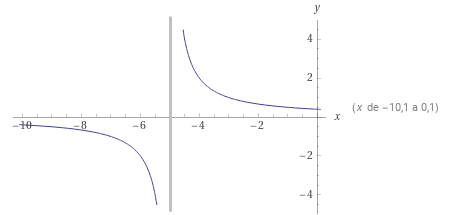

# Guía

## True or false

## Resuelve los siguientes ejercicios

1. La siguiente gráfica es de la función $f(x)={2\over {x+5}}$,

   

   determina lo siguiente:
   1. Dominio
   2. Rango
   3. Límites
   4. El siguiente límite:
        $$\lim_{x \to 2} f(x)$$

## Match
