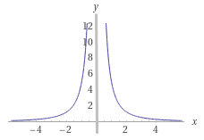
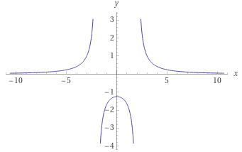
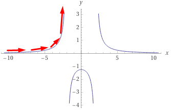
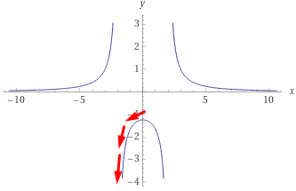
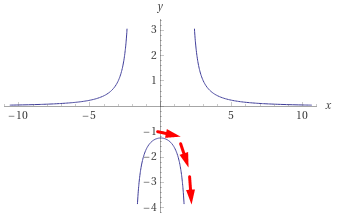
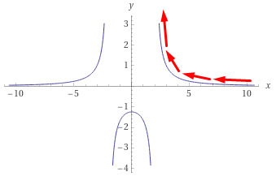

# Dudas

## Rango y dominio

Sea la función

$$f(x)={{5}\over{x^2}}$$

### Dominio

Para obtener el dominio $D$, se iguala a $0$ el denominador y se resuelve $x$.

$$x^2=0$$
$$x=\sqrt{0}$$
$$x=0$$
Esto quiere decir que se tocarán todos los valores de x, excepto el $0$

Gráficamente podemos observarlo como sigue:

Por tanto podemos decir que el dominio es desde el $-\infty$ hasta el $+\infty$ sin tocar el $0$ que se denota:
$$D=(-\infty,0)\cup(0,+\infty)$$
o también como:
$${\{x \in \Reals : x\ne0\}}$$

que se lee: *"equis petenece a los reales a excepción del cero"*

### Rango

Para la obtención del rango, se debe despejar a y:

$$y={5\over{x^2}}$$
$$\therefore$$
$$x^2y=5$$
$$x^2={5\over{y}}$$
$$x=\sqrt{5 \over y}$$

En este caso, sabemos 2 cosas:

1. Que la raíz cuadrada no puede sacarse a números negativos, es decir, que lo que está dentro de la raíz debe ser mayor o igual que $0$.
   $${5\over y} \ge 0$$
2. $y$ no puede ser $0$, porque de lo contrario la división sería por cero, entonces no podría resolverse, así que la expresión debe ser mayor que $0$.
    $${y} > 0$$

Finalmente, como $y$ sólo puede ser mayor a $0$ ese será el rango
$$R=(0,+\infty)$$
O también
$${\{y \in \Reals : y>0\}}$$
que se lee: *"ye petenece a los reales siempre y cuando sea mayor que cero"*

## Límites de una función

Tomando como ejemplo la función de rango y dominio.
$$f(x)={{5}\over{x^2-4}}$$

Para que tenga sentido la obtención de un límite, es necesario saber en qué puntos se vuelve interesante, de lo contrario sólo sería una sustitución.

El primer paso sería ver cómo es su gráfica y entender cómo es:

Aquó podemos ver que hay dos puntos en $x$ que no se pueden resolver, esto lo encontramos al resolver el *Dominio* y *Rango*.

*Dominio*:

Se resuelve el denominador de la función, esto es porque como sabemos **NO SE PUEDE DIVIDIR ENTRE $0$**.

Igualamos a $0$:
$$x^2-4=0$$
$$x^2=4$$
$$x=\pm\sqrt{4}$$
$$x_{1}=2, x_{2}=-2$$

> Puesto que la raiz cuadrada tiene dos signos, tendrémos dos valores posibles para $x$.

Si nuevamente volteamos a ver la gráfica, podemos ver que hay una [asíntota vertical](https://www.superprof.es/diccionario/matematicas/calculo/asintotas-verticales.html) en $x=-2$ y $x=2$.

Es aquí donde se vuelven interesantes los límites dado que ya no sólo son sustituciones como en los ejercicios vistos por medio de los teoremas, sino que podemos acercarnos a los valores de $x$ por la izquierda o por la derecha.

Acercamientos al $-2$

*Por la izquierda*
$$Lim_{x\rightarrow{-2^-}}$$
*Por la derecha*
$$Lim_{x\rightarrow{-2^+}}$$

Acercamientos al $2$

*Por la izquierda*
$$Lim_{x\rightarrow{2^-}}$$
*Por la derecha*
$$Lim_{x\rightarrow{2^+}}$$

Entonces tendremos un total de $4$ límites, dos por la izquierda y dos por la derecha.

Para calcularlos a través de la gráfica, sería como sigue:

$$Lim_{x\rightarrow{-2^-}}$$

En la gráfica se puede ver que si $x$ se acerca a $-2$ por la izquierda, los valores de $y$ se van haciendo cada vez más grandes, sin poder tocar ese número, es decir, se va al $\infty$ y como es hacia arriba, entonces el signo es $+$, quedando como sigue:

(1) $$Lim_{x\rightarrow{-2^-}} f(x)=+\infty$$

Para el segundo límite, ahora el acercamiento es por la derecha:

$$Lim_{x\rightarrow{-2^+}}$$

Y siguiendo el mismo criterio anterior, tenemos que se va al infinito pero ahora hacia abajo, así que el signo será $-$.

(2) $$Lim_{x\rightarrow{-2^+}} f(x)=-\infty$$

Hasta aquí tenemos los límites para cuando $x\rightarrow -2$ tando por la izquierda, como por la derecha.

Los siguientes son para $x\rightarrow2$:

|Por la izquierda|Por la derecha|
|-|-|
|||

(3) $$Lim_{x\rightarrow{2^-}} f(x)=-\infty$$
(4) $$Lim_{x\rightarrow{2^+}} f(x)=+\infty$$

En resumen, los límites serían:

(1) $$Lim_{x\rightarrow{-2^-}} f(x)=+\infty$$
(2) $$Lim_{x\rightarrow{-2^+}} f(x)=-\infty$$
(3) $$Lim_{x\rightarrow{2^-}} f(x)=-\infty$$
(4) $$Lim_{x\rightarrow{2^+}} f(x)=+\infty$$
