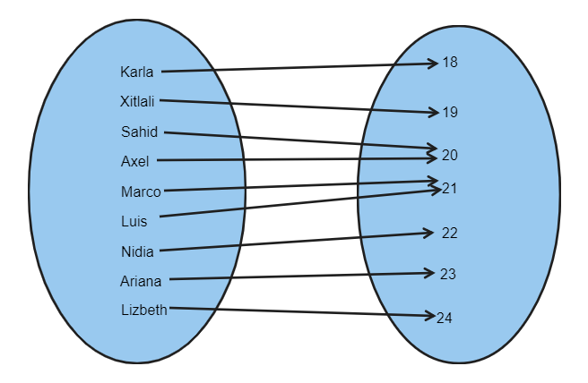
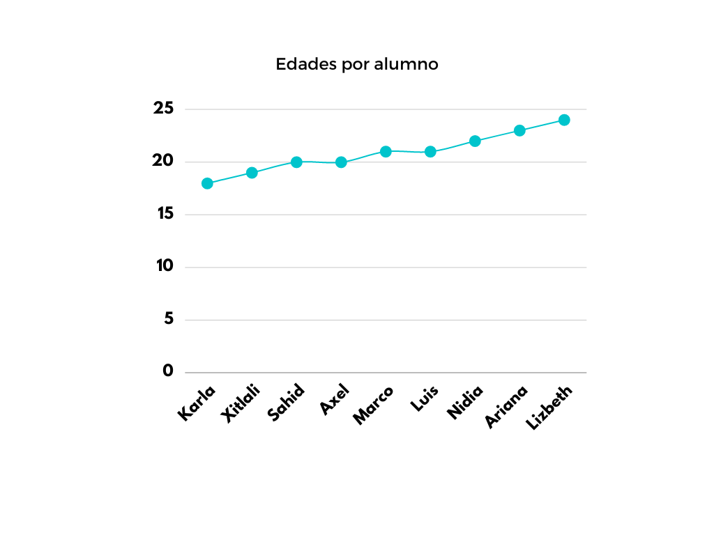
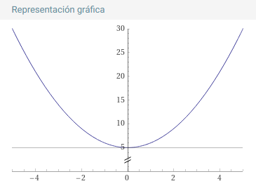
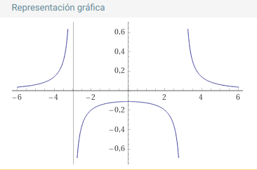

# Matemáticas II

## Índice

- [Matemáticas II](#matemáticas-ii)
  - [Índice](#índice)
  - [Repaso de funciones con caso práctico](#repaso-de-funciones-con-caso-práctico)
  - [Dominio y rango de una función](#dominio-y-rango-de-una-función)
    - [Ejemplos](#ejemplos)
  - [Actividad 1](#actividad-1)

## Repaso de funciones con caso práctico

> TODO: Falta completar esta sección

## Dominio y rango de una función

Una función se refiere a una **asignación** o **correspondencia** de un conjunto a otro. Su definición formal es la siguiente:

Una función es una terna constituida por:

1. Un conjunto $A$ llamado dominio de la función
2. Un conjunto $B$ llamado codominio de la función (Rango)
3. Una regla de correspondencia que posee tres características:

    a) A todo elemento del dominio se le puede asociar un elemento del codominio.

    b) Ningún elemento del dominio puede quedarse sin un asociado en el codominio.

    c) Ningún elemento del dominio puede tener más de un asociado en el codominio.

    Se denota como: $f : A → B$

El dominio de una función es el conjunto de valores que puede tomar la variable independiente, es decir, son todos aquellos números para los cuales la función tiene sentido (también se conoce como campo de variación).
Al elemento que se obtiene en el codominio después de aplicar la regla de correspondencia a un elemento del dominio recibe el nombre de imagen. Al conjunto de todas las imágenes se le conoce como rango.

- Ejemplo.

    Sea el conjunto de mis alumnos y otro conjunto sus edades respectivas en años:

    |Nombre|Edad|
    |-|-|
    |Luis|21|
    |Lizbeth|24|
    |Sahid|20|
    |Axel|20|
    |Xitlali|19|
    |Marco|21|
    |Ariana|23|
    |Nidia|22|
    |Karla|18|

    La tabla muestra que a cada alumno le corresponde una edad y cumple con las condiciones de función, por lo que su dominio es: `{ Luis, Lizbeth, Sahid, Axel, Xitlali, Marco, Ariana, Nidia, Karla }` y el rango es `{ 18, 19, 20, 21, 22, 23, 24 }`.

    Si se denota a $x$ como un elemento en el dominio de la función (los nombres), entonces el elemento en el rango que $f$ asocia con $x$, es la imagen de $x$ bajo la función $f$ (edades). Esto es:

    $f(Karla) = 18$

    $f(Xitlali) = 19$

    $f(Sahid) = f(Axel) = 20$

    $f(Marco) = f(Luis) = 21$

    $f(Nidia) = 22$

    $f(Ariana) = 23$

    $f(Lizbeth) = 24$

    

    

    > En términos de variables, **una función también se puede definir de la siguiente forma**: Se dice que una variable y es función de otra $x$, cuando ambas están relacionadas de forma que para cada valor de $x$ perteneciente a su campo de variación, le corresponde sólo uno de $y$. La variable $y$ recibe el nombre de variable **dependiente**, mientras que $x$ es la variable **independiente**. Lo anterior puede expresarse simbólicamente de la siguiente forma: $y = f(x)$.

Para encontrar el dominio y el rango de una función es necesario efectuar una inspección particular que analice su comportamiento, para lo cual se recomienda: para el dominio, que esté despejada la variable dependiente y para el rango que lo esté la variable independiente. A partir de esas expresiones, se efectúa un análisis que consiste básicamente en determinar los valores reales de la variable no despejada que hacen reales los valores de la variable despejada, obteniendo así el dominio y el rango respectivamente.

### Ejemplos

Determinar el dominio y el rango de las siguientes funciones:

1. $y = x^2 + 5$

    _Solución_: La función está definida para todo valor de $x$ , es decir, su **dominio** son todos los números reales ($R$): 

    $D = (-∞, ∞)$

    El valor más pequeño que puede tener $y$ es cinco, por lo tanto el rango se define como:

    $R = [5, ∞)$

    > **RECORDATORIO**: los corchetes (`[]`) nos sirven para indicar si el valor del dominio o el rango se toca y los paréntesis (`()`) cuando no se tocan. En este ejercicio, el dominio, al ser infinitos sus extremos, se expresan con paréntesis. El rango en cambio, tienen un `[` en 5, indicando que si se toca, en cambio el infinito no.

    Gráfica:

    

2. $y = {1\over {x^2-9}}$

    _Solución_: La función está definida para todo valor de $x$, exceptuando $x = −3$ y $x = 3$, ya que la división por cero no existe:

    $D = (-∞, -3) \cup (-3, 3) \cup (3, ∞)$

    La variable y toma cualquier valor exceptuando al cero: 

    $R = (-∞, 0) \cup (0, ∞)$

    Gráfica:

    

## Actividad 1

Encuentra dominio y rango de las siguientes funciones utilizando la aplicación de :1234: :point_right: [geogebra](https://www.geogebra.org/graphing):

1. $f(x) = {{2x^2 - 3} \over {x + 2}}$
2. $f(x) = {{2x^2-3} \over {x^2 - 1}}$
