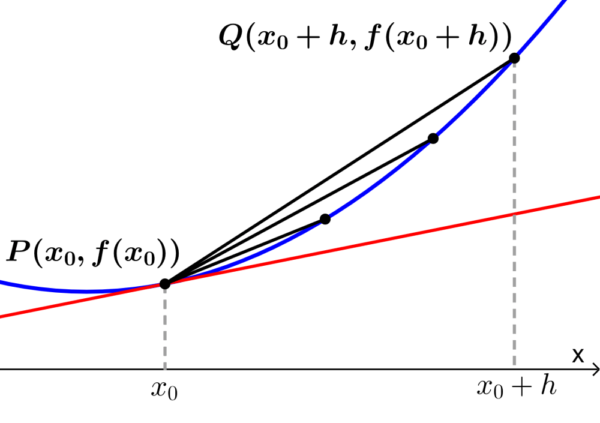
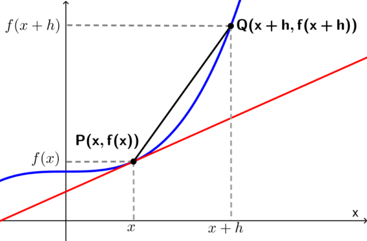

# Definición de Derivada

## Definición de la derivada como un límite

La definición de la derivada como un límite puede ser encontrada al usar la fórmula de la pendiente para encontrar la pendiente de la recta secante entre dos puntos de la función. Luego, usamos un límite para acercar a los puntos, de modo que la pendiente de la secante sea una aproximación a la pendiente de la tangente.

A continuación, aprenderemos sobre la definición de la derivada como un límite. Usaremos un diagrama para encontrar esta definición paso a paso. Luego, aplicaremos esta idea para calcular algunas derivadas.

## Contenido

- [Definición de Derivada](#definición-de-derivada)
  - [Definición de la derivada como un límite](#definición-de-la-derivada-como-un-límite)
  - [Contenido](#contenido)
  - [Cómo definir a la derivada usando límites](#cómo-definir-a-la-derivada-usando-límites)
  - [Derivadas como razón de cambio](#derivadas-como-razón-de-cambio)
  - [Ejemplos](#ejemplos)
  - [Tarea 1](#tarea-1)
  - [Tarea 2](#tarea-2)

Ver definición

## Cómo definir a la derivada usando límites

Vamos a usar límites para encontrar una ecuación que nos permita calcular la pendiente de la recta tangente a una función. Para esto usamos el siguiente diagrama:

Consideremos al punto $P(x_{0},f(x_{0}))$ que se encuentra en la curva producida por la función $f(x)$, como se muestra en el diagrama. Vamos a encontrar la pendiente de la recta tangente a $f$ en el punto $P$.

Podemos encontrar la pendiente usando el punto $Q(x_{0}+h, f(x_{0}+h))$, el cual se encuentra a $h$ unidades de $P$ y asumimos que $h$ es muy pequeño.

Entonces, empezamos calculando la pendiente de la recta secante $PQ$. Sabemos que la pendiente es igual al cambio en $y$ sobre el cambio en $x$. Entonces, tenemos:

$$Pendiente de PQ={{f(x_{0}+ℎ)−f(x_{0})}\over{x_{0}+ℎ−x_{0}}}$$

$$Pendiente de PQ={{f(x_{0}+ℎ)−f(x_{0})}\over{ℎ}}$$

Si es que $h$ es lo suficientemente pequeño, el punto $Q$ se acercará cada vez más a $P$ hasta que la pendiente de la recta secante $PQ$ será una buena aproximación para la pendiente de la recta tangente en $P$.

Entonces, definimos a la pendiente de la recta tangente como el límite de la pendiente de la recta secante a medida que $h$ se acerca a $0$:

$$m_{tan}={lim_{ℎ→0}{{f(x_{0}+ℎ)−f(x_{0})}\over{ℎ}}}$$

Ahora, en vez de usar la constante $x_{0}$, podemos usar la variable $x$. De este modo, el límite resultante será una expresión en términos de $x$.

Esta expresión puede ser considerada como una función de $x$. Además, esta función, la cual puede ser denotada por $f'(x)$, **es la derivada de la función $f$**.

Entonces, si es que tenemos que $f(x)$ es una función de $x$, la derivada de $f$ en $x$ es:

$$f'(x)={lim_{ℎ→0}{{f(x+ℎ)−f(x)}\over{ℎ}}}$$

## Derivadas como razón de cambio

La derivada de una función $f(x)$ en $x$ es la razón instantánea de cambio de la función en $x$. Esto se debe a que la derivada es definida como el límite, el cual encuentra la pendiente de la recta tangente a una función.

Recordemos que la pendiente representa el cambio en y sobre el cambio en $x$. Es decir, tenemos una razón de cambio con respecto a $x$.

Si es que $y=f(x)$ es una función de $x$, entonces, también podemos usar la notación $dx \over dy$ para representar a la derivada de $f$. $dx\over dy$  es la derivada de $y$ con respecto a $x$. Es decir, esto es la razón a la cual $y$ cambia cuando $x$ cambia.

Por ejemplo, si es que $d(t)$ representa al desplazamiento de un auto en un tiempo $t$, entonces, $d'(t)$ representa la velocidad del auto en un tiempo $t$. Si es que $y=f(x)$ es una función de $x$, entonces, $f'(x)$ representa cómo $y$ cambia cuando $x$ cambia.

Si es que $f'(x)$ es positivo en un cierto punto, entonces, $y$ incrementa a medida que $x$ incrementa. Si es que $f'(x)$ es negativo en un cierto punto, entonces, $y$ decrece a medida que $x$ incrementa.

En conclusión:

$$f'(x)={{dx}\over{dy}}={lim_{ℎ→0}{{f(x+ℎ)−f(x)}\over{ℎ}}}$$

## Ejemplos

1. Encuentra la derivada de $f(x)=3x^2$ usando la definición de la derivada con límites.

    **Solución**:

    Se usa la fórmula:

    $$f'(x)={lim_{ℎ→0}{{f(x+ℎ)−f(x)}\over{ℎ}}}$$

    Ya tenemos $f(x)$, ahora calculamos $f(x+h)$:

    > **TIP**: colocamos un paréntesis en las $x$ que encontremos en la función.

    $$f(x+h)={3(x+h)^2}$$
    $$=3[(x+h)(x+h)]$$
    $$=3(x^2+hx+hx+h^2)$$
    $$=3(x^2+2hx+h^2)$$

    Entonces:

    $$f(x+h)=3x^2+6hx+3h^2$$

    Ahora ya tenemos:

    $$f(x)=3x^2$$
    $$f(x+h)=3x^2+6hx+3h^2$$

    Sustituimos en el límite:

    $$f'(x)={lim_{ℎ→0}{{f(x+ℎ)−f(x)}\over{ℎ}}}$$

    $$f'(x)={lim_{ℎ→0}{{(3x^2+6hx+3h^2)−(3x^2)}\over{ℎ}}}$$

    $$f'(x)={lim_{ℎ→0}{{3x^2+6hx+3h^2−3x^2}\over{ℎ}}}$$

    Eliminamos los términos iguales en el numerador:

    $$3x^2-3x^2=0$$

    Nos queda:

    $$f'(x)={lim_{ℎ→0}{{6hx+3h^2}\over{ℎ}}}$$

    Se factoriza la $h$ de ambos miembros del numerador:

    $$f'(x)={lim_{ℎ→0}{{h(6x+3h)}\over{ℎ}}}$$

    Recordando que ${h\over h}=1$, nos queda:

    $$f'(x)={lim_{ℎ→0}{{(6x+3h)}}}$$

    Sabemos que el límite se calcula sustituyendo el valor al que tiende $h$ en la ecuación (en este caso es $0$).

    $$f'(x)={lim_{ℎ→0}{{(6x+3h)}}}=6x+3(0)$$

    **$$f'(x)=6x$$**

2. Encuentra la derivada de $f(x)=5x^2+6x$ usando límites.

    **Solución**:

    Se usa la fórmula:

    $$f'(x)={lim_{ℎ→0}{{f(x+ℎ)−f(x)}\over{ℎ}}}$$

    Ya tenemos $f(x)$, ahora calculamos $f(x+h)$:

    > **TIP**: colocamos un paréntesis en las $x$ que encontremos en la función.

    $$f(x+h)={5(x+h)^2+6(x+h)}$$
    $$=5[(x+h)(x+h)]+6x+6h$$
    $$=5(x^2+hx+hx+h^2)+6x+6h$$
    $$=5(x^2+2hx+h^2)+6x+6h$$

    Entonces:

    $$f(x+h)=5x^2+10hx+5h^2+6x+6h$$

    Ahora ya tenemos:

    $$f(x)=5x^2+6x$$
    $$f(x+h)=5x^2+10hx+5h^2+6x+6h$$

    Sustituimos en el límite:

    $$f'(x)={lim_{ℎ→0}{{f(x+ℎ)−f(x)}\over{ℎ}}}$$

    $$f'(x)={lim_{ℎ→0}{{(5x^2+10hx+5h^2+6x+6h)−(5x^2+6x)}\over{ℎ}}}$$

    $$f'(x)={lim_{ℎ→0}{{5x^2+10hx+5h^2+6x+6h−5x^2-6x}\over{ℎ}}}$$

    Eliminamos los términos iguales en el numerador:

    $$5x^2-5x^2=0$$
    $$6x-6x=0$$

    Nos queda:

    $$f'(x)={lim_{ℎ→0}{{10hx+5h^2+6h}\over{ℎ}}}$$

    Se factoriza la $h$ en los tres miembros del numerador:

    $$f'(x)={lim_{ℎ→0}{{h(10x+5h+6)}\over{ℎ}}}$$

    Recordando que ${h\over h}=1$, nos queda:

    $$f'(x)={lim_{ℎ→0}{{(10x+5h+6)}}}$$

    Sabemos que el límite se calcula sustituyendo el valor al que tiende $h$ en la ecuación (en este caso es $0$).

    $$f'(x)={lim_{ℎ→0}{{(10x+5h+6)}}}=10x+5(0)+6$$

    $$f'(x)=10x+6$$

## Tarea 1

Comprueba las siguientes derivadas utilizando la definición de límite:

1. $f(x)=x^3, f'(x)=3x^2$
2. $f(x)=2x^2+5x-3, f'(x)=4x+5$
3. $f(x)={1 \over x}, f'(x)=-{1 \over x^2}$

## Tarea 2

Pasar a la libreta los siguientes problemas de aplicación para revisarlos en clase.

1. La demanda de un artículo que produce una compañía varía con el precio que ésta cobra por el artículo. La compañía determinó que los ingresos totales anuales $I(x)$ (en miles de pesos) son una función del precio $p$ (en pesos). Específicamente $I(p) = -50p2 + 500p$,

    a) Determina el precio que debe cobrarse con el fin de maximizar los ingresos totales.

    b) ¿Cuál es el valor de los ingresos anuales totales?
2. Un fruticultor calcula que, si se siembran $60$ árboles por hectárea, cada árbol dará $500$ manzanas al año aproximadamente. Si el rendimiento promedio por árbol se reduce a $5$ manzanas por cada árbol adicional que se plante por hectárea. ¿Cuántos árboles por hectárea deben plantarse para maximizar la producción de dicha fruta?
