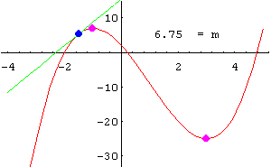
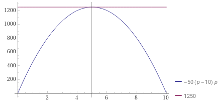

# EQUIPO 1

La demanda de un artículo que produce una compañía varía con el precio que ésta cobra por el artículo. La compañía determinó que los ingresos totales anuales I(x) (en miles de pesos) son una función del precio p (en pesos). Específicamente $I(p) = -50p2 + 500p$,

a) Determina el precio que debe cobrarse con el fin de maximizar los ingresos totales
b) ¿Cuál es el valor de los ingresos anuales totales?

**Solución a)**:

Como ya nos dan la función solo procedemos a aplicar los criterios de la derivada conocidos.

$${{d}\over{dx}}[f(x)+{g(x)}]=f'(x)+{g'(x)}$$

Si $f(p)=-50p^2$ y $g(p)=500p$, entonces derivamos como sigue:

$${{d}\over{dp}}I(p)=-50{{d}\over{dp}}p^2+500{{d}\over{dp}}p$$

$$=-50(2p^{2-1})+500(1p^{1-1})$$

$$=-100p^1+500p^0$$

$$=-100p+500$$

> :bulb:recordando que $p^0=1$

Entonces: $I'(p) = -100p + 500$

|Recordatorio|
|-|
|Recordemos que la pendiente de una recta es igual a la tangente de su ángulo de inclinación $$m = tan({\alpha})$$También recordemos que la primera derivada de una función $$dy\over{dx}$$ es igual a la pendiente de cualquier recta tangente a la curva que representa a dicha función y si queremos encontrar un máximo o un mínimo esa pendiente debe ser *cero*, que es donde la recta es completamente horizontal como se ve en la siguiente imagen.|

Entonces igualando a cero:

$$-100p + 500 = 0$$

$$-100p=-500$$

$$p={{-500}\over{-100}}=5$$

Etonces $p = 5$ pesos es el valor crítico para máximo o mínimo.

*El precio que la compañía debe cobrar para que el ingreso sea máximo es de 5 pesos por unidad.*

Sacamos la segunda derivada: 

$${{d}\over{dp}}I'(p)=-100{{d}\over{dp}}p+{{d}\over{dp}}500$$

$$=-100(1p^{1-1})+0$$

$$=-100p^0$$

$$=-100$$

$$I''(p) = -100$$

Evaluando el valor crítico $I''(5) = -100 < 0$ entonces $I(p)$ es $∩$ y se comprueba que hay un máximo.

**Solución b)**:

Evaluando $p=5$ en $I(p) = -50p^2 + 500$

$$I(5) = -50(5)^2 + 500(5)$$

$$=-50(25)+2500=-1250+2500=1250$$

Se espera que los ingresos anuales totales sean máximos en $1250.0 miles de pesos cuando la compañía cobre 5 pesos por unidad.

|Gráfica|Resultados|
|-|-|
||La maximización de ingresos se da al tener un ingreso de $1250.0 miles de pesos y haber vendido a $5 cada artículo.|
