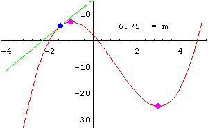

# EQUIPO 2

Un fruticultor calcula que, si se siembran 60 árboles por hectárea, cada árbol dará 500 manzanas al año aproximadamente. Si el rendimiento promedio por árbol se reduce a 5 manzanas por cada árbol adicional que se plante por hectárea. ¿Cuántos árboles por hectárea deben plantarse para maximizar la producción de dicha fruta?

**Solución**:

En este problema no se da la función, entonces vamos a buscarla con la información del problema. Hacemos el ajuste tomando $x$ cómo el número de árboles adicionales que serán plantados para obtener la producción ajustada $P$.

|Producción|Número de árboles|Número de frutos|
|-|-|-|
|Inicial|$60$|$500$|
|Ajuste|$60+x$|$500-5x$|

> :bulb: Sabemos que para obtener el total de producción deben multiplicarse el numero total de árboles por la producción de cada uno, es decir $P=N_{arboles}*N_{frutos}$ lo que al inicio nos da un total de $30,000$ frutos. Para el ajuste sabemos que $x$ representa cada árbol adicional en la hectárea, entonces $N_{árboles}=60+x$ y los frutos sabemos que por cada $x$ árboles, los 500 que produce se reducen en $5$, lo que se expresa $N_{frutos}=500-5x$

Sabiendo los datos anteriores, resulta la siguiente función:

$$P(x)=(60+x)(500-5x)$$

Desarrollando

$$P(x)=30000-300x+500x-5x^2$$

$$P(x)=30000+200x-5x^2$$

Que es nuestra función a maximizar.

Derivando:

$${{d}\over{dx}}P(x)={{d}\over{dx}}30000+200{{d}\over{dx}}x-5{{d}\over{dx}}x^2$$

$$=0+200(1x^{1-1})-5(2x^{2-1})$$

$$=0+200x^0-10x^1=200-10x$$

$$P'(x)=200-10x$$

|Recordatorio|
|-|
|Recordemos que la pendiente de una recta es igual a la tangente de su ángulo de inclinación $$m = tan({\alpha})$$También recordemos que la primera derivada de una función $$dy\over{dx}$$ es igual a la pendiente de cualquier recta tangente a la curva que representa a dicha función y si queremos encontrar un máximo o un mínimo esa pendiente debe ser *cero*, que es donde la recta es completamente horizontal como se ve en la siguiente imagen.|

Entonces igualando a cero:

$$200-10x=0$$

$$-10x=-200$$

$$x={{-200}\over{-10}}$$

$$x=20$$

Que es valor crítico para máximo o mínimo.

*Se necesitan plantar 20 árboles adicionales para obtener la producción ajustada.*

Sacando la segunda derivada:

$${{d}\over{dx}}P'(x)={{d}\over{dx}}200-10{{d}\over{dx}}x$$

$$=0-10(1x^{1-1})=-10x^0=-10$$

$$P''(x)=-10$$

Evaluamos si en $x = 20$ hay un máximo o un mínimo aplicando el criterio de la segunda derivada.

$P''(20)=-10$, entonces $P(x)$ es $∩$ y se comprueba que hay un máximo.

Evaluando $x=20$ en $P(x)=-5x^2+200x+30000$ tenemos:

$$P(20)=-5(20)^2+200(20)+30000$$

$$=-5(400)+4000+30000$$

$$=-2000+34000=32000$$

|Gráfica|Resultados|
|-|-|
||Se deben plantar 20 árboles extras por hectárea para maximizar la producción a 32,000 manzanas por ha.|
