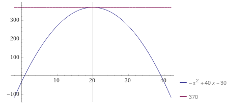
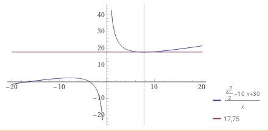

# EQUIPO 3

El costo de producción de $x$ unidades diarias de un producto es de

$${1\over{2}}x^2+10x+30$$

y el precio unitario de venta en pesos es de

$$50-{1\over{2}}x$$

Encuentra:

a) Número de unidades que se deben vender para obtener un beneficio máximo.
b) Demuestre que el costo de producción de una unidad tiene un mínimo.

**Solución a)**:

> :bulb: Sabemos que la función para encontrar la utilidad en las ventas es $U(x)=I(x)-C(x)$, donde $I$ y $C$ representan el *ingreso* y *costo de producción* respectivamente.

Entonces sabiendo que

$$C(x)={1\over{2}}x^2+10x+30$$

y que el total de ingresos se calcula multiplicando el total de productos vendidos por su valor unitario, tenemos

$$I(x)=x(50-{1\over{2}}x)$$

Completando la fúnción de la utilidad tenemos:

$$U(x)=x(50-{1\over{2}}x)-({1\over{2}}x^2+10x+30)$$

$$=50x-{1\over{2}}x^2-{1\over{2}}x^2-10x-30$$

$$=50x-x^2-10x-30$$

$$U(x)=-x^2+40x-30$$

Esta última función es la que se tiene que maximizar.

Derivamos:

$${{d}\over{dx}}U(x)=-{{d}\over{dx}}x^2+40{{d}\over{dx}}x-{{d}\over{dx}}30$$

$$=-(2x^{2-1})+40(1x^{1-1})-0$$

$$=-2x^1+40x^0=-2x+40$$

$$U'(x)=-2x+40$$

|Recordatorio|
|-|
|Recordemos que la pendiente de una recta es igual a la tangente de su ángulo de inclinación $$m = tan({\alpha})$$También recordemos que la primera derivada de una función $$dy\over{dx}$$ es igual a la pendiente de cualquier recta tangente a la curva que representa a dicha función y si queremos encontrar un máximo o un mínimo esa pendiente debe ser *cero*, que es donde la recta es completamente horizontal como se ve en la siguiente imagen.|

Entonces igualando a cero:

$$-2x+40=0$$

$$-2x=-40$$

$$x={{-40}\over{-2}}$$

$$x=20$$

Que es valor crítico para máximo o mínimo.

*Se necesitan vender 20 unidades diarias.*

Sacando la segunda derivada:

$${{d}\over{dx}}U'(x)=-2{{d}\over{dx}}x+{{d}\over{dx}}40$$

$$=-2(1x^{1-1})+0=-2x^0=-2$$

$$U''(x)=-2$$

Ahora aplicamos el criterio de la segunda derivada para saber si en $x = 20$ hay un máximo o un mínimo.

$U''(20)=-2$, entonces $U(x)$ es $∩$ y se comprueba que hay un máximo.

Evaluando $x=20$ en $U(x)=-x^2+40x-30$ tenemos:

$$U(20)=-(20)^2+40(20)-30$$

$$=-400+800-30=370$$

|Gráfica|Resultados|
|-|-|
||Se deben vender 20 unidades diarias para obtener una utilidad máxima de 370 pesos.|

**Solución b)**:

Para resolver el inciso, tenemos que encontrar el promedio del costo por unidad. Esto es diviendo el costo total de producción entre las unidades producidas.

$$\overline{C(x)}={C(x)\over{x}}$$

$$C_{unitario}(x)={{{1\over{2}}x^2+10x+30}\over{x}}$$

Que es nuestra función a minimizar.

Obtenemos la primera derivada usando

$${{d}\over{dx}}[{f(x)\over{g(x)}}]={{g(x)f'(x)-f(x)g'(x)}\over{[g(x)]^2}}$$

Si $f(x)={1\over{2}}x^2+10x+30$ y $g(x)=x$ entonces la derivada es:

$${{d}\over{dx}}{{{1\over{2}}x^2+10x+30}\over{x}}$$

$$={{(x){{d}\over{dx}}({1\over{2}}x^2+10x+30)-({1\over{2}}x^2+10x+30){{d}\over{dx}}x}\over{x^2}}$$

$$={{(x)(x+10)-({1\over{2}}x^2+10x+30)(1)}\over{x^2}}$$

$$={{x^2+10x-({1\over{2}}x^2+10x+30)}\over{x^2}}$$

$$={{x^2+10x-{1\over{2}}x^2-10x-30}\over{x^2}}$$

$$={{{1\over{2}}x^2-30}\over{x^2}}$$

$$={{{1\over{2}}x^2}\over{x^2}}-{{30}\over{x^2}}$$

$$C_{unitario}'(x)={1\over{2}}-{{30}\over{x^2}}$$

Igualamos a *cero*:

$${1\over{2}}-{{30}\over{x^2}}=0$$

$${1\over{2}}=0+{{30}\over{x^2}}$$

$${1\over{2}}={{30}\over{x^2}}$$

$$1(x^2)=30(2)$$

$$x^2=60$$

$$x=\sqrt{60}$$

$$x_{1}=7.75, x_{2}=-7.75$$

> :bulb: Recordemos que la raíz cuadrada tiene dos signos, por lo tanto dos valores. En este caso el de nuestro interés es el positivo, toda ves que no podemos definir un precio unitario negativo.

Dado que el número de unidades debe ser entera, acercamos el valor al próximo entero y tenemos:

$$x=8$$

Sacando la segunda derivada:

$${{d}\over{dx}}C_{unitario}'(x)={{d}\over{dx}}{1\over{2}}-30{{d}\over{dx}}x^{-2}$$

$$=0-30(-2x^{-2-1})=60x^{-3}={{60}\over{x^3}}$$

$$C_{unitario}''(x)={{60}\over{x^3}}$$

Ahora aplicamos el criterio de la segunda derivada para saber si en $x = 8$ hay un máximo o un mínimo.

$$C_{unitario}''(8)={{60}\over{(8)^3}}$$

$$={{60}\over{512}}=0.117$$

entonces $C_{unitario}(x)$ es $\cup$ y se comprueba que hay un mínimo.

Evaluando $x=8$ en $C_{unitario}(x)={{{1\over{2}}x^2+10x+30}\over{x}}$ tenemos:

$$C_{unitario}(8)={{{1\over{2}}(8)^2+10(8)+30}\over{8}}$$

$$={{{1\over{2}}(64)+80+30}\over{8}}$$

$$={{32+80+30}\over{8}}={{142}\over{8}}$$

$$=17.75$$

|Gráfica|Resultados|
|-|-|
||El costo de producción promedio tiene un mínimo de 8 unidades diarias producidas con un costo mínimo de 17.75|
