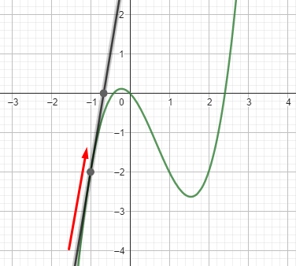
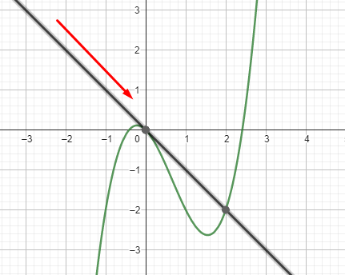
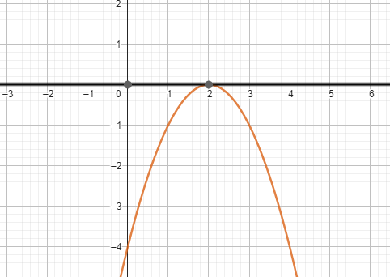
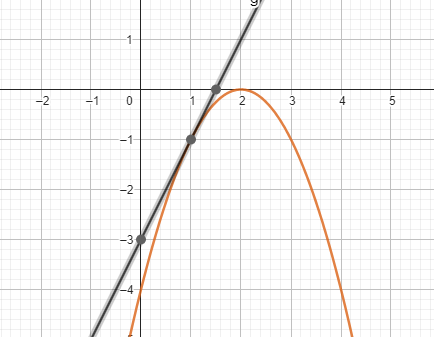
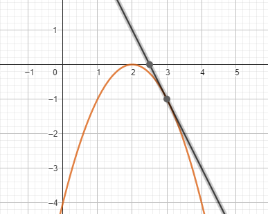
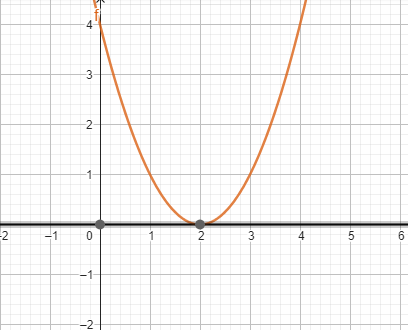
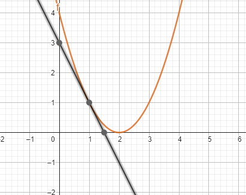
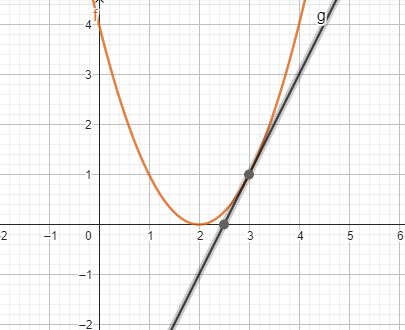

# La Derivada

La visión de Newton y Leibnitz para relacionar los grandes problemas de la mecánica y de la geometría de la ciencia del siglo XVII, que básicamente se referían a incrementos y cantidades de cambio en el estudio del movimiento y la determinación de tangentes a una curva dada, respectivamente, proporcionó el método general para resolverlos que ya conocemos como derivación (o diferenciación). En el desarrollo de estas teorías surge la teoría del criterio de la primera derivada. Ahora la problemática no será el uso de la herramienta (derivar), sino la interpretación de los resultados.

La derivación de funciones es una herramienta muy poderosa que, asociada a la metodología del criterio de la primera derivada, permite encontrar los valores máximos y mínimos de una función. Para comprender este proceso, es necesario relacionarlo a la interpretación geométrica de la derivada.

Entonces estaremos observando los cambios de la pendiente a la curva, que se reflejan en el signo de esta, ya que también cambia el ángulo de la pendiente, debido a su posición en algún punto en la curva.

## Desarrollo del tema

Vamos a empezar recordando algunos conceptos básicos que nos van a ser útiles para aplicar el criterio de la primera derivada con el objetivo de encontrar máximos y mínimos.

> :bulb: Recordemos que la pendiente de una recta es igual a la tangente de su ángulo de inclinación $m = \tan{\theta}$.

También recordemos que la primera derivada de una función $dy / dx$ es igual a la pendiente de cualquier recta tangente a la curva que representa a dicha función.

**Definición**:

$f(x)$ es creciente en $x = a$ si $f'(x) > 0$ y $f(x)$ es decreciente en $x = b$ si $f'(x) < 0$

En las siguientes gráficas se ilustra la definición dada de la función creciente y decreciente en algún valor de $(x)$ cuando la primera derivada es positiva o negativa.

|$f(x)$ creciente|$f(x)$ decreciente|
|-|-|
|||

Observamos cómo la pendiente cambia de dirección cuando cambiamos el valor de $(x)$, y este movimiento de la pendiente a lo largo de la curva, cambia su ángulo y por lo tanto el signo.

Observamos que independientemente del valor de $(x)$, el signo de la derivada nos dirá si tenemos que $f(x)$ es creciente o decreciente.

Ahora vamos a aprender cómo se calculan máximos y mínimos utilizando la información anterior. Tomemos en cuenta que si el ángulo de inclinación de una recta tangente a una curva es igual a 0; entonces la pendiente $m_{T}$ y la primera derivada $f'(x)$ es igual a cero. ¿Cuándo sucede esto?

**Definición 1**:

$f(x)$ tiene un máximo en $x = c$ si cumple con las siguientes condiciones:

1. Que $f'(c) = 0$
2. Que $f'(x)$ para un valor un poco menor que $c$ sea positiva $(>0)$, es decir, que $f(x)$ para dicho valor sea **creciente**.
3. Que $f'(x)$ para un valor un poco mayor que $c$ sea negativa $(<0)$, es decir, que $f(x)$ para dicho valor sea **decreciente**.

|Condición 1 $c=2$|Condición 2 $x=1$|Condición 3 $x=3$|
|-|-|-|
||||

**Definición 2**:

$f(x)$ tiene un mínimo en $x = c$ si cumple con las siguientes condiciones:

1. Que $f'(c) = 0$
2. Que $f'(x)$ para un valor un poco menor que $c$ sea negativo $(<0)$, es decir, que $f(x)$ para dicho valor sea **decreciente**.
3. Que $f'(x)$ para un valor un poco mayor que $c$ sea positivo $(>0)$, es decir, que $f(x)$ para dicho valor sea **creciente**.

|Condición 1 $c=2$|Condición 2 $x=1$|Condición 3 $x=3$|
|-|-|-|
||||

## Aplicación

Un criterio común para seleccionar alguna opción, en la toma de decisiones en las áreas de las ciencias sociales tiene como objetivo maximizar algún beneficio. Esto se refiere a la ganancia total de la empresa, la utilidad que tiene un producto o un servicio para un consumidor, la calidad del producto, entre otros.  Por otro lado, se desea minimizar el costo de producción total o de un producto terminado, los tiempos muertos en la línea de producción, o los desperdicios de material, así como los costos de envío.

En economía se clasifican los problemas de **maximización** o **minimización** como problemas de optimización y deben entenderse como "la búsqueda de lo mejor". Sin embargo, los términos máximo o mínimo, de forma matemática, no implican una optimización y es por esto por lo que también se les conoce como valores extremos.

Debemos recordar que la esencia del problema de optimización es elegir, sobre la base del criterio seleccionado, la mejor alternativa para resolver un problema.

Uno de los objetivos de una empresa es lograr el máximo beneficio o utilidad $U(x)$. Esto se refiere a la cantidad de dinero que ha de ganar al vender sus productos y obtener un ingreso $I(x)$ por esa venta, menos la parte que corresponde a solventar los gastos necesarios o costos $C(x)$ para llevar a cabo la producción.

$U(x) = I(x) – C(x)$

La empresa siempre espera vender la mayor cantidad de artículos que le sea posible a fin de obtener el máximo de ganancia, pero si desea vender tanto, también debe reducir al máximo los costos en los que incurre al llevar a cabo su ciclo productivo, es decir, la empresa espera optimizar sus recursos al maximizar su beneficio y minimizar sus costos.

**Maximizar el beneficio de cualquier empresa implica**:

- Maximizar el ingreso, es decir, vender la mayor cantidad de artículos posibles con un nivel de costos constante.
- Maximizar el ingreso y minimizar el nivel de costos.
- Minimizar los costos y mantener constante el nivel de ventas para que no se vea afectado el ingreso.

A veces no es tan importante solo conocer los niveles de utilidad o el beneficio total de una empresa, sino que interesa más el impacto en las utilidades ante pequeñas variaciones en los insumos y por esto al maximizar o minimizar es relevante la marginalidad de una función.

:brain: Piensa que para una empresa es relevante conocer en qué monto se incrementarán sus costos :money_with_wings: cuando tiene que producir mayor cantidad de bienes, o bien, en qué cantidad se incrementarán sus utilidades cuando crecen sus ingresos :dollar:. Así lo que interesa conocer es el ingreso marginal, el costo marginal y por lo tanto, la utilidad marginal. Se conoce que, si el ingreso total se iguala al costo total, la utilidad o beneficio será cero, pero si el ingreso marginal se iguala al costo marginal, la utilidad será máxima o mínima.

## Además

- Lleven su formulario impreso o escrito, pueden llevar calculadora si lo desean.
