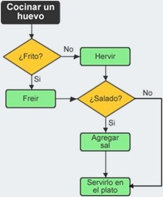
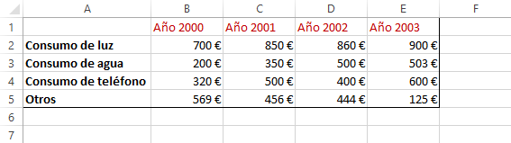
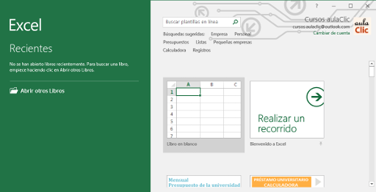
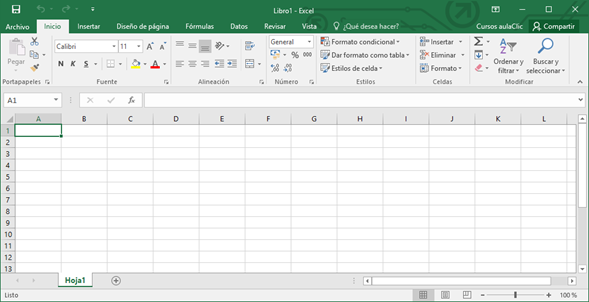
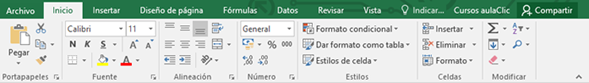
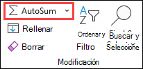
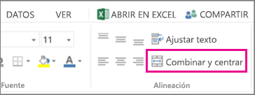
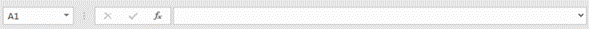
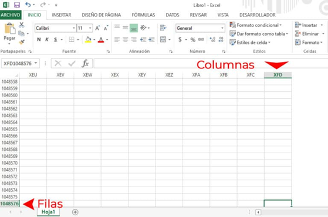
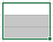

# INFORMÁTICA II

## Índice

- [INFORMÁTICA II](#informática-ii)
  - [Índice](#índice)
  - [Unidad I](#unidad-i)
    - [Problema](#problema)
    - [Algoritmos](#algoritmos)
      - [Características de los algoritmos](#características-de-los-algoritmos)
    - [Diagramas de flujo](#diagramas-de-flujo)
      - [Símbolos utilizados](#símbolos-utilizados)
    - [Pseudocódigo](#pseudocódigo)
      - [Estructuras de control](#estructuras-de-control)
        - [Estructura secuencial](#estructura-secuencial)
        - [Estructura alternativa](#estructura-alternativa)
        - [Estructura repetitiva](#estructura-repetitiva)
    - [Excel](#excel)
      - [La pantalla inicial](#la-pantalla-inicial)
        - [La cinta de opciones](#la-cinta-de-opciones)
        - [La barra de fórmulas](#la-barra-de-fórmulas)
        - [La barra de etiquetas](#la-barra-de-etiquetas)
        - [Las barras de desplazamiento](#las-barras-de-desplazamiento)
        - [La barra de estado](#la-barra-de-estado)
        - [¿Qué es una Columna en Excel? (Hoja de Cálculo)](#qué-es-una-columna-en-excel-hoja-de-cálculo)
        - [¿Qué es una Fila en Excel](#qué-es-una-fila-en-excel)
        - [Celdas](#celdas)
          - [Dirección de una celda](#dirección-de-una-celda)
          - [Selección de un rango de celdas](#selección-de-un-rango-de-celdas)

## Unidad I

### Problema

La Real Academia de la Lengua Española define: "Problema" como "Conjunto de hechos o circunstancias que dificultan la consecución de algún fin" mientras que Wikipedia lo define como: "Un asunto del que se espera una solución"; entonces tenemos, que un problema puede definirse como una situación, con un grado de dificultad variable, que debe aclararse o resolverse y que puede tener un número determinado o indefinido de soluciones.

Muchos de los problemas pueden resolverse con intervención de la computadora (entendiéndose como tal una tablet, laptop, smartphone, equipo de escritorio o dispositivo similar); por ejemplo: editar un video, elaborar una gráfica, saber el estado del tráfico de la ciudad o enviar un documento importante a otra persona. Pero hay otros en los que, debido a sus características, la máquina, definitivamente, no puede ayudarte en la solución.

### Algoritmos

Se denomina algoritmo a un conjunto finito de instrucciones o pasos, ordenados de manera lógica, que permiten solucionar un determinado problema.
Esta palabra proviene del nombre del matemático y astrónomo árabe Al-Khwarizmi quien vivió en Bagdad entre los siglos VII y VIII y quien también es considerado el Padre del álgebra.
Los algoritmos están relacionados con la Metodología de Solución de Problemas, debido a que nos ayudan a plantearnos diferentes alternativas para resolverlos, así como elegir y desarrollar la más adecuada de ellas. Es por ello que un algoritmo es la técnica más importante para la resolución de problemas.

#### Características de los algoritmos

- **Finito**. Debe tener un número determinado de pasos, un inicio y un final.
- **Legible**: El texto que lo describe debe ser claro, tal que permita entenderlo y leerlo fácilmente.
- **Preciso**. Cada paso debe estar muy claro, ser breve y concreto, evitando ambigüedades.
- **Eficaz**. El algoritmo debe resolver el problema.
- **Eficiente**. Debe resolver el problema utilizando de forma óptima los recursos disponibles.
- **Definido**. Si se sigue un algoritmo dos o más veces, se debe obtener el mismo resultado cada vez que se aplica en problemas del mismo tipo.

### Diagramas de flujo

**Es la representación gráfica de un algoritmo**. Para su construcción se usan símbolos estandarizados en el que cada uno tiene un significado. Los pasos del algoritmo se escriben dentro del símbolo correspondiente y se unen por flechas, denominadas "líneas de flujo", que indican el orden en que los pasos deben de llevarse a cabo.

#### Símbolos utilizados

Ejemplo

### Pseudocódigo

Es un "falso lenguaje" (pseudo = falso) mezcla de instrucciones de programación y de palabras del lenguaje natural para la especificación de algoritmos. Es una herramienta muy efectiva para el seguimiento de la lógica de un algoritmo y para transformarlo con facilidad a un programa informático.

#### Estructuras de control

Los algoritmos vistos hasta el momento han consistido en simples secuencias de instrucciones; sin embargo, existen tareas más complejas que no pueden ser resueltas empleando un esquema tan sencillo, en ocasiones es necesario repetir una misma acción un número determinado de veces o evaluar una expresión y realizar acciones diferentes en base al resultado de dicha evaluación.

Para resolver estas situaciones existen las denominadas estructuras de control que poseen las siguientes características:

- Una estructura de control tiene un único punto de entrada y un único punto de salida.
- Una estructura de control se compone de sentencias o de otras estructuras de control.

Tales características permiten desarrollar de forma muy flexible todo tipo de algoritmos aun cuando sólo existen tres tipos fundamentales de estructuras de control:

- Secuencial.
- Alternativa.
- Repetitiva.

##### Estructura secuencial

La estructura secuencial es la más sencilla de todas, simplemente indica al procesador que debe ejecutar de forma consecutiva (una debajo de la otra) una lista de acciones (que pueden ser, a su vez, otras estructuras de control); para construir una secuencia de acciones basta con escribir cada acción en una línea diferente.

##### Estructura alternativa

La estructura alternativa permite bifurcar (partir en dos caminos) el "flujo" del programa en función de una expresión lógica; disponemos de tres estructuras alternativas diferentes: alternativa simple, alternativa doble y alternativa múltiple.

##### Estructura repetitiva

La estructura repetitiva o iterativa permite, como su propio nombre indica, repetir una acción (o grupo de acciones); dicha repetición puede llevarse a cabo un número prefijado de veces o depender de la evaluación de una expresión lógica. Existen tres tipos de estructuras repetitivas: desde-hasta, mientras y repetir-hasta.

### Excel

Excel es una aplicación que permite realizar hojas de cálculo que se encuentra integrada en el conjunto ofimático de programas Microsoft Office. Esto quiere decir que si ya conoces otro programa de Office, como Word, Access, Outlook, PowerPoint, Sway... te resultará familiar utilizar Excel, puesto que muchos iconos y comandos funcionan de forma similar en todos los programas de Office.

Una hoja de cálculo sirve para trabajar con números de forma sencilla e intuitiva. Para ello se utiliza una cuadrícula donde en cada celda de la cuadrícula se pueden introducir números, letras y gráficos.

#### La pantalla inicial

Al iniciar Excel aparece una pantalla inicial como esta:

Si abrimos un Libro en blanco, clicando sobre la primera opción del menú de la derecha, se nos mostrará una hoja de cálculo. Vamos a ver sus componentes fundamentales: así conoceremos los nombres de los diferentes elementos y será más fácil entender el resto del curso. La pantalla que se muestra a continuación (y en general todas las de este curso) puede no coincidir exactamente con la que ves en tu ordenador, ya que cada usuario puede decidir qué elementos quiere que se vean en cada momento, como veremos más adelante.

##### La cinta de opciones

La cinta de opciones es uno de los elementos más importantes de Excel, ya que contiene todas las opciones del programa organizadas en pestañas. Al pulsar sobre una pestaña, accedemos a la ficha.
Las fichas principales son Inicio, Insertar, Diseño de página, Fórmulas, Datos, Revisar y Vista. En ellas se encuentran los distintos botones con las opciones disponibles.
Pero, además, cuando trabajamos con determinados elementos, aparecen otras de forma puntual: las fichas de herramientas. Por ejemplo, mientras tengamos seleccionado un gráfico, dispondremos de la ficha Herramientas de gráficos, que nos ofrecerá botones especializados para realizar modificaciones en los gráficos.

Por ejemplo, para encontrar Autosuma

Autosum se encuentra en dos ubicaciones: **Inicio** > **Autosum** y **Fórmulas** > **Autosum**.

Para encontrar Combinación de celdas:

Combinar y centrar se encuentra en **Inicio** > **Alineación** > **Combinar y centrar**.

##### La barra de fórmulas

Nos muestra el contenido de la celda activa, es decir, la casilla donde estamos situados. Cuando vayamos a modificar el contenido de la celda, dicha barra variará ligeramente, pero esto lo estudiaremos más adelante.

##### La barra de etiquetas

Permite movernos por las distintas hojas del libro de trabajo.

##### Las barras de desplazamiento

Permiten movernos a lo largo y ancho de la hoja de forma rápida y sencilla, simplemente hay que desplazar la barra arrastrándola con el ratón, o hacer clic en los triángulos.

##### La barra de estado

##### ¿Qué es una Columna en Excel? (Hoja de Cálculo)

Una columna en excel, es una hilera vertical de celdas. Las columnas podemos identificarlas por letras que se ubican en la parte superior en una hoja de cálculo y podemos encontrarlas hasta la columna XFD.
Desde la versión de Excel 2007 hasta la versión de Excel 2010 las hojas de cálculo de un libro de Excel tienen un máximo de 16,384 columnas. Anteriormente, la versión de Excel 2003 solo tenía un máximo de columnas de 256.

##### ¿Qué es una Fila en Excel

Una fila en excel, es una hilera horizontal de celdas que está representada por un número ubicado al lado izquierdo de la hoja de cálculo.
En la versión de Excel 2010 el máximo de filas que podemos tener son de 1.048.576 y en versiones anteriores de Excel como la 2007 puedes encontrar un máximo de 65.536 filas en las hojas de cálculo. Como vemos, ambas versiones de Excel nos brinda una gran cantidad de filas suficientes para trabajar ampliamente con nuestros datos.

##### Celdas

Una celda es la intersección de una fila y una columna. En las celdas se pueden introducir modelos numéricos y utilizarlos todas las veces que sea necesario para efectuar cálculos numéricos y de análisis.
Toda la información de una hoja de cálculo se introduce en las celdas.

###### Dirección de una celda

Como lo hemos mencionado anteriormente, cada celda está conformada por columnas y filas, y tienen una dirección que estará formada por la columna seguida de la fila. Un ejemplo de esto es la dirección A1, en la cual estamos haciendo referencia a la columna A y la fila 1. En este sentido, esta sería la dirección de la celda, también podemos observar la dirección de la celda en el cuadro de nombre como se observa en la siguiente imagen.

###### Selección de un rango de celdas

Para seleccionar un conjunto de celdas adyacentes, pulsar el botón izquierdo del ratón en la primera celda a seleccionar y mantener pulsado el botón del ratón mientras se arrastra hasta la última celda a seleccionar, después soltarlo y verás como las celdas seleccionadas aparecen con un marco alrededor y cambian de color.
