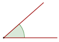

# MATEMÁTICAS II

## Índice

- [MATEMÁTICAS II](#matemáticas-ii)
  - [Índice](#índice)
  - [Triángulos](#triángulos)
    - [Ángulos](#ángulos)
      - [Clasificación según su medida](#clasificación-según-su-medida)
      - [Clasificación según su posición](#clasificación-según-su-posición)
      - [Clasificación según su suma](#clasificación-según-su-suma)
      - [Ángulos entre rectas paralelas y una recta transversal](#ángulos-entre-rectas-paralelas-y-una-recta-transversal)
    - [Clasificación de los triángulos](#clasificación-de-los-triángulos)
      - [Tipos de triángulos según sus lados](#tipos-de-triángulos-según-sus-lados)
      - [Tipos de triángulos según sus ángulos](#tipos-de-triángulos-según-sus-ángulos)
    - [Propiedades de los triángulos](#propiedades-de-los-triángulos)
  - [Anexos](#anexos)
    - [Fórmulas](#fórmulas)

## Triángulos

### Ángulos

#### Clasificación según su medida

Los ángulos se miden en grados (`°`) y según su medida se clasifican en:

1. **Nulo**: es aquel que mide $0°$. Las semirectas que forman los ángulos coinciden.

    

2. **Agudo**: es aquel que mide más de $0°$ y menos de $90°$.

    

3. **Recto**: es aquel que mide $90°$.

    

4. **Obtuso**: es aquel que mide mas de $90°$ y menos de $180°$.

    

5. **Extendido o llano**: es aquel que mide $180°$.

    

6. **Completo**: es aquel que mide los $360°$.

    

7. **Cóncavos y convexos**: son dos clasificaciones de ángulos más generales con respecto a los que ya hemos visto.

    Los convexos son aquellos que miden menos de $180°$. Mientras que los cóncavos tienen una amplitud de entre $180°$ y $360°$.

    Esto significa que los ángulos convexos pueden ser a la vez `obtusos`, `agudos`, y `rectos`, ya que todos ellos miden menos de $180°$.

    |Convexo|Cóncavo|
    |-|-|
    |||
8. **Negativo**: mide menos de $0°$.

   Los **ángulos negativos** giran en el **sentido horario**, es decir, en el sentido en que se mueven las agujas de un reloj.

    Un **ángulo negativo** lo podemos transformar en un **ángulo positivo** sumándole $360°$.

    $-30° = 360° - 30° = 330°$

#### Clasificación según su posición

1. **Consecutivos**: Son aquellos que tienen el vértice y un lado común.

    

2. **Adyacentes**: Son aquellos que tienen el vértice y un lado común, y los otros lados situados uno en polongación del otro. Forman un **ángulo llano**.

    

3. **Opuestos por el vértice**: Son los que teniendo el vértice común, los lados de uno son prolongación de los lados del otro.

    

    Los ángulos $1$ y $3$ son iguales.

    Los ángulos $2$ y $4$ son iguales.

#### Clasificación según su suma

1. **Complementarios**: Dos ángulos son complementarios si suman $90°$.

    

2. **Suplementarios**: Dos ángulos son suplementarios si suman $180°$.

    

#### Ángulos entre rectas paralelas y una recta transversal

1. Ángulos **correspondientes**

    

    Los ángulos $1$ y $2$ son iguales.

2. Ángulos **alternos internos**

    

    Los ángulos $2$ y $3$ son iguales.

3. Ángulos **alternos externos**

    

    Los ángulos $1$ y $4$ son iguales.

### Clasificación de los triángulos

#### Tipos de triángulos según sus lados

1. Triángulo **equilátero**

    

    Tiene los **tres lados iguales**.

2. Triángulo **isósceles**

    

    Tiene **dos lados iguales**.

3. Triángulo **escaleno**

    

    Sus **tres lados son diferentes**.

#### Tipos de triángulos según sus ángulos

1. Triángulo **acutángulo**

    

    Tiene los **tres ángulos agudos**.

2. Triángulo **rectángulo**

    

    Tiene **un ángulo recto**. El lado mayor es la hipotenusa.

3. Triángulo obtusángulo

    

    Tiene **un ángulo obtuso**.

### Propiedades de los triángulos

1. Un lado de un triángulo es menor que la suma de los otros dos y mayor que su diferencia.

2. La suma de los ángulos interiores de un triángulo es igual a $180°$ (Recordando la fórmula revisada en clase :point_right:[fórmulas](#fórmulas)).

3. El valor de un ángulo exterior es igual a la suma de los dos interiores no adyacentes.

## Anexos

### Fórmulas

|Objetivo|Fórmula|Descripción|
|-|-|-|
|Suma de ángulos interiores de un poligono|$S = 180°(n-2)$, donde $n$ es el número de lados del polígono|Para obtener la suma de los ángulos interiores de un polígono, se aplica la fórmula. Ejemplo: La suma de los ángulos internos del heptágono (7 lados) se calcularía $180°(7-2)=180°(5)=900°$|
