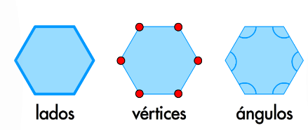
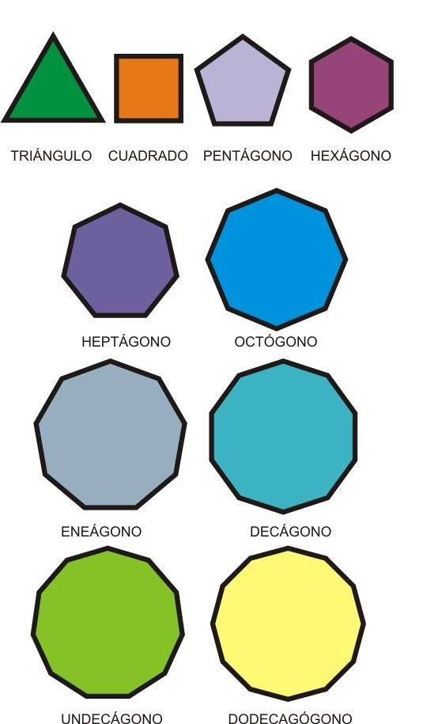

# Propiedades de los poligonos

## ¿Qué es un polígono?

Un polígono es aquella figura geométrica y plana que está conformada por un grupo finito de segmentos rectos en secuencia que encierran una determinada región en el plano. Cada uno de estos segmentos se les nombra como **lados**, y aquello puntos en donde estos intersectan se llaman **vértices**.

Esta figura se forma por segmentos de recta que se unen dos a dos por sus extremos. Si los segmentos o lados de esta figura son rectos se denomina como **polígono regular**, ahora si uno de sus lados no lo es, se llama **polígono irregular**.

## Indice

- [Propiedades de los poligonos](#propiedades-de-los-poligonos)
  - [¿Qué es un polígono?](#qué-es-un-polígono)
  - [Indice](#indice)
  - [¿Cuáles son las propiedades de los polígonos?](#cuáles-son-las-propiedades-de-los-polígonos)
    - [Propiedades internas](#propiedades-internas)
    - [Propiedades externas del polígono](#propiedades-externas-del-polígono)
    - [Propiedad numérica](#propiedad-numérica)
    - [Trazo de diagonales](#trazo-de-diagonales)
    - [Otras propiedades de los polígonos](#otras-propiedades-de-los-polígonos)
  - [Tarea](#tarea)

## ¿Cuáles son las propiedades de los polígonos?

### Propiedades internas

Las propiedades internas de un polígono corresponde al conjunto de cada uno de sus puntos, los cuales se encuentran dentro de la región que delimita esta figura.

Un polígono que tenga $n$ lados, **la suma de todos sus ángulos interiores es**:

$$180° (n-2)$$

para el cálculo se toma cualquier vértice de referencia y se traza $(n-2)$ triángulos en la figura. La suma de los ángulos internos del polígono será la suma de los ángulos de los triángulos.

### Propiedades externas del polígono

Estas propiedades corresponden al conjunto de todos los puntos que no forman parte de la línea poligonal o frontera, ni tampoco forman parte de su interior.

La suma de todos los ángulos exteriores de un polígono siempre será igual a $360°$, ya que la suma de los ángulos exteriores e interiores de un vértice es $180°$.

### Propiedad numérica

En los polígonos los **ángulos interiores**, **los vértices**, **los ángulos centrales** y los **ángulos exteriores** son **iguales**. Para calcularlos se utilizan las siguientes fórmulas:

|Propiedad|Fórmula|Explicación|
|-|-|-|
|Ángulo interior|$$A_{int} = {{180°(n-2)}\over{n}}$$|Donde $n$ es el número de lados.|
|Vértices| $$N_{V} = n$$|El número de vértices es igual al número de lados|
|Ángulo central|$$A_{cent}={360°\over{n}}$$|El ángulo central será igual a 360° entre $n$ que es el número de lados|
|Ángulo exterior|$$A_{ext}={360°\over{n}}$$|El ángulo exterior será igual a 360° entre $n$ que es el número de lados|

Esta última fórmula del ángulo exterior la vimos en clase como sigue:

$$A_{int}+A_{ext}=180°$$

Si $$A_{int} = {{180°(n-2)}\over{n}}$$

Sustituimos y queda:

$${{180°(n-2)}\over{n}}+A_{ext}=180°$$

Resolvemos:

$$A_{ext}=180°-{{180°(n-2)}\over{n}}$$

$$A_{ext}=180°[1-{{(n-2)}\over{n}}]$$

$$A_{ext}=180°[1-({{n}\over{n}}-{{2}\over{n}})]$$

$$A_{ext}=180°[1-(1-{{2}\over{n}})]$$

$$A_{ext}=180°(1-1+{{2}\over{n}})$$

$$A_{ext}=180°({{2}\over{n}})$$

$$A_{ext}={{360°}\over{n}}$$

:bomb: Les evito la pena de utilizar la fórmula larga y con esta pueden obtener el ángulo externo:bomb:

### Trazo de diagonales

En un polígono se puede tomar uno de sus vértices y trazar $(n-3)$ diagonales. El número de diagonales en total que se puede trazar en un polígono se calcula con la fórmula:

$$N_{D}={{n(n-3)}\over{2}}$$

Donde $(n-3)$ corresponde a las diagonales que pueden ser trazadas en cada vértice ya que en la figura siempre hay tres vértices en los que no se pueden trazar diagonales, el vértice desde donde se realiza el trazo y el de los dos contiguos.

Cuándo se traza diagonales a partir de un mismo vértice se consigue $(n-2)$ triángulos.

### Otras propiedades de los polígonos

- En polígonos convexos sus ángulos interiores son agudos.
- La medida de los ángulos internos de un polígono cóncavo sea de uno o más ángulos es cóncavo.
- Los lados en un polígono equilátero siempre son congruentes.
- En los polígonos equiángulos sus ángulos interiores muestran una medida congruente.
- Los polígonos regulares son equiángulos y al mismo tiempo equiláteros.
- Los lados de los polígonos irregulares presentan siempre diferentes longitudes.

## Tarea

Para las siguientes figuras, obtener los que se solicita en la tabla.

Esta tabla tiene que ir a la libreta y llenar.

|Figura|Ángulo central|Angulo interior|Ángulo exterior|Vertices|Diagonales|
|-|-|-|-|-|-|
|||||||

Ejemplo:

_Para el triángulo_:

- Angulo central
  
  $$A_{cent}={360°\over{n}}={360°\over{3}}=120°$$

- Angulo interior
  
  $$A_{int}={{180°(n-2)}\over{n}}={{180°(3-2)}\over{3}}={{180°(1)}\over{3}}={180°\over{3}}=60°$$

- Ángulo exterior
  
  $$A_{ext}={360°\over{n}}={360°\over{3}}=120°$$

- Vertices
  
  $$N_{V}=n=3$$

- Diagonales
  
  $$N_{D}={{n(n-3)}\over{2}}={{3(3-3)}\over{2}}={{3(0)}\over{2}}={0\over{2}}=0$$

Llenamos la tabla como sigue:

|Figura|Ángulo central|Angulo interior|Ángulo exterior|Vertices|Diagonales|
|-|-|-|-|-|-|
||$120°$|$60°$|$120°$|$3$|$0$|
