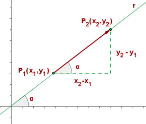

# MATEMÁTICAS III

## Índice

- [MATEMÁTICAS III](#matemáticas-iii)
  - [Índice](#índice)
  - [Sistema de coordenadas cartesianas en el plano](#sistema-de-coordenadas-cartesianas-en-el-plano)
    - [Ejes de coordenadas](#ejes-de-coordenadas)
    - [Signos](#signos)
  - [Funciones lineales](#funciones-lineales)
    - [Tabla de valores](#tabla-de-valores)
    - [Pendiente $m$](#pendiente-m)
      - [Cálculo de la pendiente](#cálculo-de-la-pendiente)

## Sistema de coordenadas cartesianas en el plano

Un **sistema de coordenadas cartesianas** lo forman dos ejes perpendiculares entre sí, que se cortan en el origen.

Las **coordenadas de un punto** cualquiera vendrán dadas por las proyecciones de la distancia entre el punto y el origen sobre cada uno de los ejes.

### Ejes de coordenadas

Al **sistema de coordenadas** también se le llama **ejes de coordenadas o ejes cartesianos**.

El **eje horizontal** se llama eje `X` o *eje de abscisas*.

El **eje vertical** se llama eje `Y` o *eje de ordenadas*.

El punto $O$, donde se cortan los dos ejes, es el **origen de coordenadas**.

**Las coordenadas de un punto** cualquiera `P` se representan por $(x, y)$.

La **primera coordenada** se mide sobre el eje de abscisas, y se la denomina **coordenada $x$ del punto o abscisa del punto**.

La **segunda coordenada** se mide sobre el eje de ordenadas, y se le llama **coordenada $y$ del punto u ordenada del punto**.

**Los ejes de coordenadas dividen al plano en cuatro partes iguales y a cada una de ellas se les llama cuadrante.**

### Signos

||Abscisa|Ordenada|
|-|-|-|
|1er cuadrante|+|+|
|2do cuadrante|−|+|
|3er cuadrante|−|−|
|4to cuadrante|+|−|

El **origen de coordenadas**, $O$, tiene de coordenadas: $O(0, 0)$.

Los **puntos** que están en el **eje de ordenadas** tienen su abscisa **igual a $0$**.

Los **puntos** situados en el **eje de abscisas** tienen su ordenada **igual a $0$**.

Los puntos situados en la misma línea horizontal (paralela al eje de abscisas) tienen la **misma ordenada**.

Los puntos situados en una misma línea vertical (paralela al eje de ordenadas) tienen la **misma abscisa**.

$A(1, 4), B(-3, 2), C(0, 5), D(-4, -4),$

$E(-5, 0), F(4, -3), G(4, 0), H(0, -2)$

## Funciones lineales

Una **función lineal** es aquella cuya expresión algebraica es del tipo $y = mx$, siendo $m$ un número cualquiera distinto de $0$.

- Su gráfica es **una línea recta** que pasa por el origen, $O(0,0)$.
- El número $m$ se llama **pendiente**.
- La función es **creciente** si $m > 0$ y **decreciente** si $m < 0$.
  
|Creciente|Decreciente|
|-|-|
|$y=2x$|$y=-2x$|
|||

Ejemplos:

1. Vamos a representar gráficamente la función lineal $y = 2x$.

    Para ello, vamos a construir su tabla de valores, pero no debemos olvidar que su gráfica es una recta que pasa por el origen, por lo que bastará dar un valor a $x$ y obtener su correspondiente de $y$. Después uniremos ese punto obtenido con el origen de coordenadas mediante una línea recta.

    Tomamos el valor $-2$ y lo sustituimos en la ecuación:

    $y=2(-2)=-4$

    |$x$|$y$|
    |-|-|
    |$-2$|$-4$|

    

    Así podemos calcular el resto de valores deseados:

    |$x$|$y$|
    |-|-|
    |$-2$|$-4$|
    |$-1$|$-2$|
    |$0$|$0$|
    |$1$|$2$|

### Tabla de valores

Una tabla es una representación de datos, mediante pares ordenados, expresan la relación existente entre dos magnitudes o dos situaciones.

La siguiente tabla dos muestra la variación del precio de los jitomates, según el número de kilogramos que compremos.

|Kg de jitomates|1|2|3|4|5|
|-|-|-|-|-|-|
|Precio en $\$$|23|46|69|92|115|

La siguiente tabla nos indica el número de alumnos que consiguen una determinada nota en un examen.

|Nota|0|1|2|3|4|5|6|7|8|9|10|
|-|-|-|-|-|-|-|-|-|-|-|-|
|Nº de alumnos|1|1|2|3|6|11|12|7|4|2|1|

### Pendiente $m$

La **pendiente** es la **inclinación** de la recta con respecto al eje de abscisas.

Se denota con la letra $m$.

**Si $m > 0$ la función es creciente** y **ángulo** que forma la recta con la parte positiva del eje $OX$ es **agudo**.

**Si m < 0 la función es decreciente** y **ángulo** que forma la recta con la parte positiva del eje $OX$ es **obtuso**.

La pendiente de una recta es la tangente del ángulo que forma la recta con la dirección positiva del eje de abscisas.

#### Cálculo de la pendiente

1. Pendiente dado el ángulo $\alpha$

    $m=\tan \alpha$

2. Pendiente dados dos puntos

    $m={{y_{2}-y_{1}}\over{x_{2}-x_{1}}}$

3. Pendiente dada la ecuación de la recta.

    $m=-{A\over{B}}$

Ejemplos

1. La pendiente de la recta que pasa por los puntos $A(2, 1)$, $B(4, 7)$ es:

    $m={{y_{2}-y_{1}}\over{x_{2}-x_{1}}}={{7-1}\over{4-2}}={{6}\over{2}}=3$

2. La recta que pasa por los puntos $A(1, 2)$, $B(1, 7)$ no tiene pendiente, ya que la división por $0$ no está definida.

    $m={{y_{2}-y_{1}}\over{x_{2}-x_{1}}}={{7-2}\over{1-1}}={{5}\over{0}}=IND$
