# Funciones lineales

En matemáticas las funciones determinan el tipo de relación entre dos elementos o variables entre sí. Por lo tanto, son muy útiles para describir fenómenos, en especial, en áreas como las Finanzas, Estadísticas, Ingeniería, Medicina, Economía, entre otros. Hoy queremos dedicarnos este artículo a hablar sobre qué es una función lineal y cómo se representa. Así que te invitamos a leerlo si este tema es de tu interés.

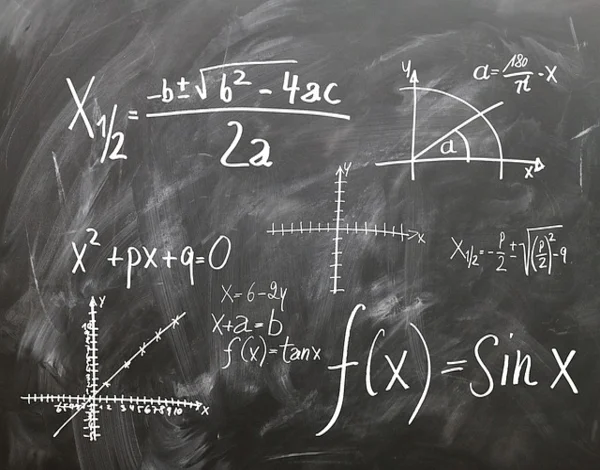

## ¿Qué encontrarás aquí?

- [Funciones lineales](#funciones-lineales)
  - [¿Qué encontrarás aquí?](#qué-encontrarás-aquí)
  - [Descubre qué es una función lineal y cómo se representa](#descubre-qué-es-una-función-lineal-y-cómo-se-representa)
    - [¿Qué es una función lineal y cómo se representa?](#qué-es-una-función-lineal-y-cómo-se-representa)
    - [Elementos de la función lineal](#elementos-de-la-función-lineal)
    - [Formas de representación de la función lineal](#formas-de-representación-de-la-función-lineal)
    - [Representación cartesiana](#representación-cartesiana)
  - [Pendiente de la Recta](#pendiente-de-la-recta)
    - [Fórmula de la pendiente de una recta](#fórmula-de-la-pendiente-de-una-recta)
      - [Ejemplo de cómo calcular la pendiente de una recta a partir de dos puntos](#ejemplo-de-cómo-calcular-la-pendiente-de-una-recta-a-partir-de-dos-puntos)
    - [Hallar la pendiente de una recta a partir de su ecuación](#hallar-la-pendiente-de-una-recta-a-partir-de-su-ecuación)
      - [Pendiente dada la ecuación explícita de la recta](#pendiente-dada-la-ecuación-explícita-de-la-recta)
      - [Pendiente dada la ecuación punto-pendiente de la recta](#pendiente-dada-la-ecuación-punto-pendiente-de-la-recta)
      - [Pendiente dada la ecuación implícita de la recta](#pendiente-dada-la-ecuación-implícita-de-la-recta)
      - [Pendiente dado un ángulo](#pendiente-dado-un-ángulo)
    - [Significado de la pendiente de una recta](#significado-de-la-pendiente-de-una-recta)
    - [Posición relativa de las rectas](#posición-relativa-de-las-rectas)

## Descubre qué es una función lineal y cómo se representa

### ¿Qué es una función lineal y cómo se representa?

Dentro de la **Geometría Analítica y Álgebra**, se conoce como una función polinómica en primer grado que se representa de la siguiente forma:

$$y = mx + b$$

Si analizamos la expresión, vemos como al tener el valor de $x$, lo primero que debe hacerse es multiplicarlo por $m$ y el producto sumarlo a $b$. Por lo tanto, el resultado de toda esta operación será el valor de $y$.

Las funciones lineales son muy útiles para el cálculo de fenómenos que ocurren en la vida cotidiana. Por ejemplo: *el costo de los servicios básicos como el agua, la luz o el gas*, pueden ser determinados a través de esta función. Además del monto, será posible tener en cuenta la proporción en los casos de aumentos.

Entre las características que pueden mencionarse de una función lineal se encuentran:

- Su representación en el plano cartesiano corresponde a una línea recta (razón por la que se le conoce como función lineal).
- $m$ representa un valor de cambio, mientras que $b$ es una constante.

### Elementos de la función lineal

Atendiendo a su forma de expresión $y = mx + b$, los elementos que la componen son:

- $x$: variable independiente (su valor no depende de ninguna otra variable y puede ser asignado libremente).
- $y$ (o también llamada $f(x)$:Corresponde a la variable dependiente (su valor depende de $x$).
- $m$: se refiere a la **pendiente**, la cual determina **el grado de inclinación de la recta**.
- $b$: se conoce como origen y corresponde al corte de eje.

### Formas de representación de la función lineal

Como vimos a través de una expresión o fórmula sirve para representar una función lineal, sin embargo, este proceso también es posible a través de una tabla o un gráfico.

Para dejar más en claro qué es una función lineal y cómo se representa, vayamos a un ejemplo.

Tabla
Tenemos la siguiente función:  $y = 2x + 0$

Según esta fórmula es posible determinar cuál tabla y valores deben registrarse.

|$x$|$y$|
|-|-|
|0|0|
|2|4|
|4|8|

Aquí, los valores de $x$ fueron designados de forma arbitraria, mientras que los de $y$ se originaron a partir del cálculo de una ecuación lineal:

$$y = mx$$

De modo que, el primer valor se calcula a partir de la multiplicación de $m=2$ por $x = 0$.

$$y = 2*0$$

$$y = 0$$

Mientras que el segundo se calcula por $m = 2$ por $x = 2$. Quedan así:

$$y = 2*2$$

$$y= 4$$

Al fijarnos en la tabla y en la operación vemos como los valores representan puntos que pueden estar en el plano cartesiano.

### Representación cartesiana

Al graficar tomamos los valores $(x, y)$ plasmados en la tabla, o los obtenidos a través de la operación y representamos.

$$A = (0,0)$$

$$B = (2,4)$$

$$C = (4,8)$$

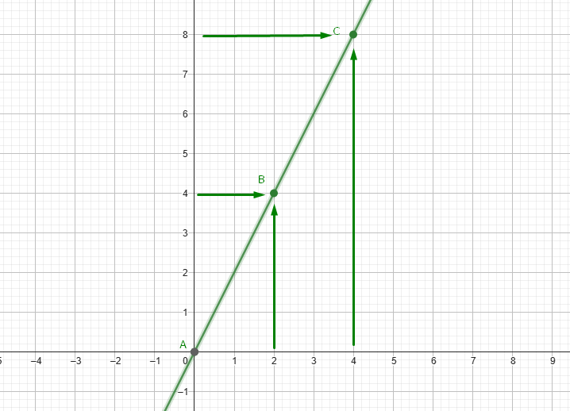

Como vemos, se forma una recta lineal con crecimiento proporcional, lo que quiere decir, que se trata de una función constante donde el aumento de valor de $x$, es proporcional al valor de $y$.

Al igual que cada aspecto de las matemáticas, las funciones lineales son aplicables en la realidad.

## Pendiente de la Recta

### Fórmula de la pendiente de una recta

La pendiente de una recta es igual al desplazamiento vertical entre dos puntos dividido por el desplazamiento horizontal entre esos dos mismos puntos.

Es decir, dados dos puntos de un recta:

$$P_1(x_1,y_1) \qquad P_2(x_2,y_2)$$

La fórmula de la pendiente de una recta es:

$$m = \cfrac{\Delta y}{\Delta x} = \cfrac{y_2-y_1}{x_2-x_1}$$

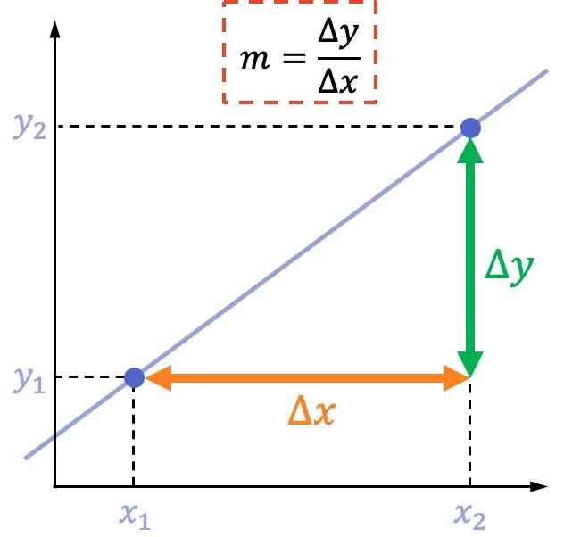

#### Ejemplo de cómo calcular la pendiente de una recta a partir de dos puntos

A continuación vamos a ver un ejemplo de cómo se calcula la pendiente de una recta con la fórmula:

1. Calcula la pendiente de la recta que pasa por los siguientes dos puntos:

   $$P_1(3,1) \qquad P_2(5,7)$$

    Para hallar la pendiente de esta recta, simplemente se debe aplicar su fórmula:

    $$m = \cfrac{\Delta y}{\Delta x} = \cfrac{y_2-y_1}{x_2-x_1}=\cfrac{7-1}{5-3}=\cfrac{6}{2} = 3$$

    Por tanto, la pendiente de la recta es igual a $3$.

### Hallar la pendiente de una recta a partir de su ecuación

En el apartado de arriba acabamos de ver cómo determinar la pendiente de una recta numéricamente. Sin embargo, no siempre hace falta hacer cálculos, sino que también se puede identificar su valor a partir de la ecuación de una recta. Cada tipo de ecuación es diferente, por lo que analizaremos cada caso por separado.

#### Pendiente dada la ecuación explícita de la recta

La ecuación explícita de la recta sigue la siguiente expresión:

$$y =\color{blue}m\color{red}x+n$$

Entonces, el parámetro $m$ corresponde a la **pendiente de la recta**.

#### Pendiente dada la ecuación punto-pendiente de la recta

La fórmula de la ecuación punto-pendiente de la recta es la siguiente:

$$y -y_0=\color{blue}m\color{red}(x-x_0)$$

Igual que antes, el coeficiente $m$ corresponde a la pendiente de la recta.

#### Pendiente dada la ecuación implícita de la recta

Dada la ecuación implícita de la recta (también conocida como ecuación general o cartesiana):

$$Ax+By+C=0$$

La pendiente de la recta se puede encontrar haciendo:

$$m=-\cfrac{A}{B}$$

#### Pendiente dado un ángulo

Por último, si una recta forma un ángulo $\theta$ con la parte positiva del eje de las abscisas (eje $x$), su pendiente es equivalente a la tangente del ángulo:

$$m = \text{tan}(\theta)$$

### Significado de la pendiente de una recta

Con toda la información de arriba ya sabemos completamente cómo sacar la pendiente de una recta. Pero realmente… ¿qué significa la pendiente de una recta?

:bulb: **La pendiente de una recta indica las unidades verticales que sube la recta por cada unidad horizontal de la gráfica.**

Por ejemplo, en la representación de la siguiente recta puedes ver que avanza $2$ unidades verticales por cada unidad horizontal, porque su pendiente es igual a $2$.

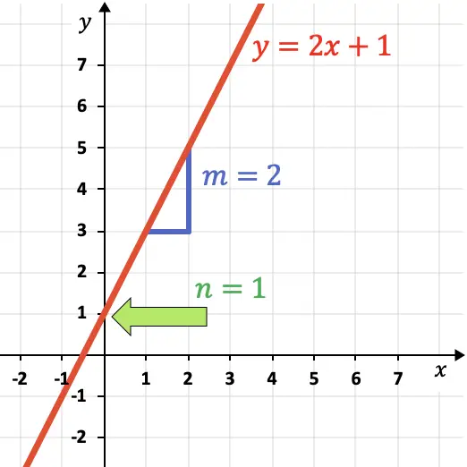

Además, :book:**la pendiente de una recta también indica su inclinación**:

|Gráfica|Dirección de la recta|
|-|-|
|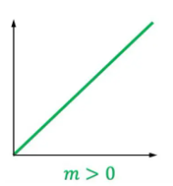|Si una recta es **creciente** (va hacia arriba), su **pendiente es positiva**.|
|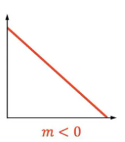|Si una recta es **decreciente** (va hacia abajo), su **pendiente es negativa**.|
|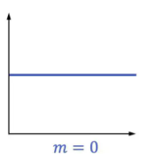|Si una recta es **completamente horizontal**, su pendiente es igual a $0$.|
|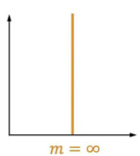|Si una recta es **totalmente vertical**, su pendiente es equivalente a **infinito**.|

### Posición relativa de las rectas

Por otro lado, también se puede conocer la posición relativa entre dos rectas a partir de las propiedades de las pendientes:

- Si dos rectas tienen pendientes diferentes significa que son **secantes**, es decir, que se cortan en algún punto.
  
  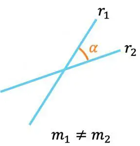
  
  Además, se puede calcular el ángulo que forman las dos rectas a través de sus pendientes con la siguiente fórmula:
  
  $$\text{tan}(\alpha) = \cfrac{m_2-m_1}{1+m_1\cdot m_2}$$

- En segundo lugar, si dos rectas tienen la **misma pendiente** implica que **son paralelas**.

  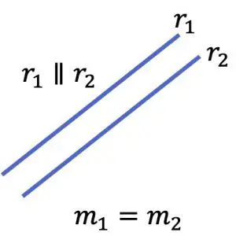

- Por último, las pendientes de dos rectas **perpendiculares** u **ortogonales** (que forman $90º$) cumplen la siguiente condición:
  
  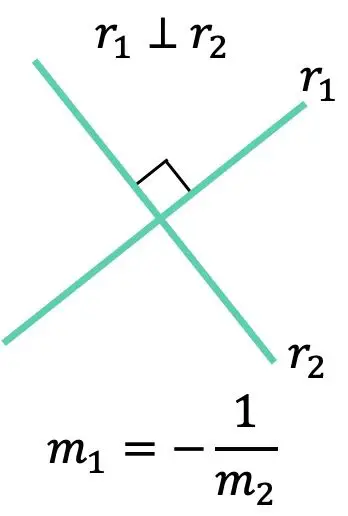

Esta es una forma de saber si dos rectas son paralelas o perpendiculares entre sí, sin embargo, existen más métodos e incluso algunos son más rápidos.
