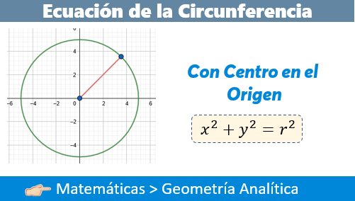
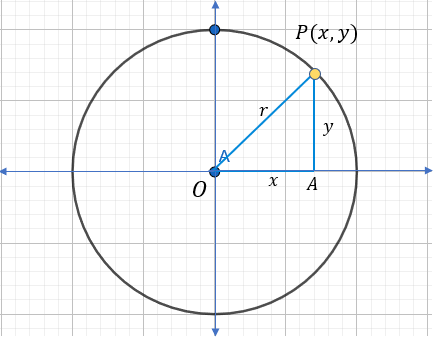
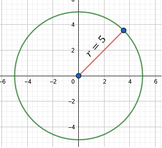
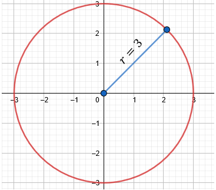

# Ecuación de la Circunferencia con Centro en el Origen

Dentro de la geometría analítica, existe el caso principal para el estudio de la Circunferencia, y aunque en este artículo nos apegaremos más para el caso de la ecuación de la circunferencia con centro el origen, es importante indicar la definición de circunferencia, así como cada una de sus partes y componentes para comprender mejor el tema. La fórmula que estaremos empleando por ahora será la siguiente:

$$x^{2}+y^{2}=r^{2}$$

A la circunferencia la podemos definir de la siguiente forma:

> :book: Es aquél lugar geométrico que describe un punto que se mueve en el plano de tal forma que su distancia a un punto fijo llamado centro, es siempre constante.

Dicha curva plana y cerrada la podemos encontrar de forma geométrica de la siguiente forma:

## Formas de expresar la ecuación de la circunferencia

Hay diversas formas de expresar la ecuación de la circunferencia:

🔸 Ecuación de la circunferencia en su forma ordinaria

$${{(x-h)}^{2}}+{{(y-k)}^{2}}={{r}^{2}}$$

Dónde el centro es el punto $C (h , k)$ y de radio $r$.

🔸Ecuación de la circunferencia en su forma general
También podemos encontrar la ecuación de la circunferencia en su forma general, de la siguiente manera:

$$A{{x}^{2}}+C{{y}^{2}}+Dx+Ey+F=0$$

Considerando que:

$$A=C$$

y finalmente.

🔸 Ecuación de la circunferencia en su forma canónica
En este artículo, se hablará de la circunferencia en su forma canónica, es decir cuando la circunferencia posee su centro en el origen. Se reduce a la siguiente ecuación:

$${{x}^{2}}+{{y}^{2}}={{r}^{2}}$$

De aquí podemos concluir tres puntos importantes de la circunferencia.

⭕ Si $r$ es positivo se dice que la circunferencia es real :crown:.

⭕ Si $r$ es negativo se dice que la circunferencia es imaginaria :cloud:.

⭕ Si $r$ es igual a cero entonces representa un punto.

## Ejercicios Resueltos de la Ecuación de la Circunferencia con Centro el Origen

Vamos a comenzar a resolver algunos ejercicios empleando la forma canónica de la ecuación.

:cookie: **Ejemplo 1**. Determinar la ecuación de la circunferencia de centro en el origen cartesiano y de radio 5.

:child: **Solución**:

Recordemos que nuestra ecuación canónica de la circunferencia con centro el origen es la siguiente:

$${{x}^{2}}+{{y}^{2}}={{r}^{2}}$$

De aquí observamos que lo único que tenemos que colocar en la fórmula es el radio y elevarlo al cuadrado.

$${{x}^{2}}+{{y}^{2}}={{(5)}^{2}}$$

Al elevar esto nos da:

$${{x}^{2}}+{{y}^{2}}=25$$

De forma gráfica esto es así:

:cookie: **Ejemplo 2**. Una circunferencia tiene su centro en el origen y su radio es de 3 unidades. ¿Cuál es su ecuación en forma general?

:child: **Solución**:

A diferencia del ejercicio anterior, en este problema nos piden la ecuación en su forma general, es decir, debemos expresar la ecuación igualada a cero. Veamos entonces como realizarlo.

La forma canónica nos dice:

$${{x}^{2}}+{{y}^{2}}={{r}^{2}}$$

Sustituyendo en nuestros datos:

$${{x}^{2}}+{{y}^{2}}={{(3)}^{2}}$$

Elevando al cuadrado, obtenemos:

$${{x}^{2}}+{{y}^{2}}=9$$

Podríamos decir que es el resultado en términos de la ecuación canónica. Pero como nos piden en forma general, vamos a igualar a cero la ecuación:

$${{x}^{2}}+{{y}^{2}-9}=0$$

Veamos la gráfica del ejercicio:

:cookie: **Ejemplo 3**. Determinar la ecuación de la circunferencia con centro en el origen y de radio 3/4.

:child: **Solución**:

Nuevamente, planteamos nuestra fórmula:

$${{x}^{2}}+{{y}^{2}}={{r}^{2}}$$

Y colocamos el dato del radio:

$${{x}^{2}}+{{y}^{2}}={{\left( \frac{3}{4} \right)}^{2}}$$

Elevamos al cuadrado tanto el numerador como denominador, recordar las propiedades de potencia.

Y obtendremos la respuesta.

$${{x}^{2}}+{{y}^{2}}=\frac{9}{16}$$

Qué de forma gráfica, esto es:

:star: Ahora ya sabes obtener la ecuación de la circunferencia :star:

