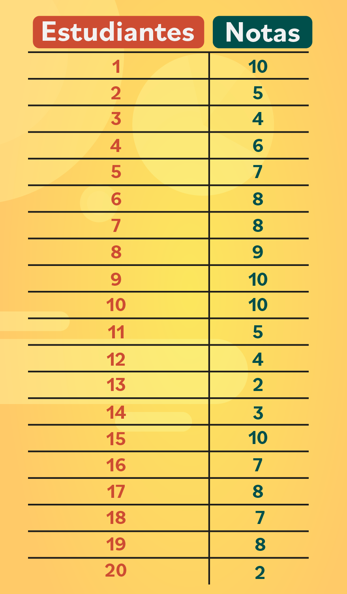
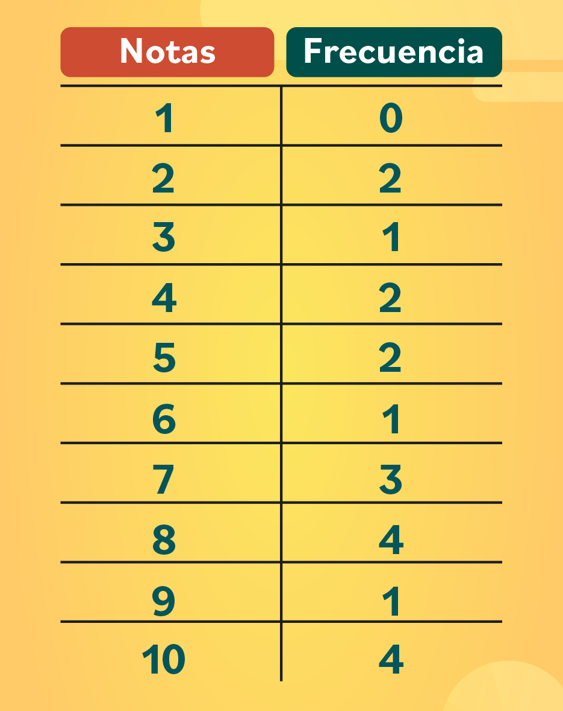
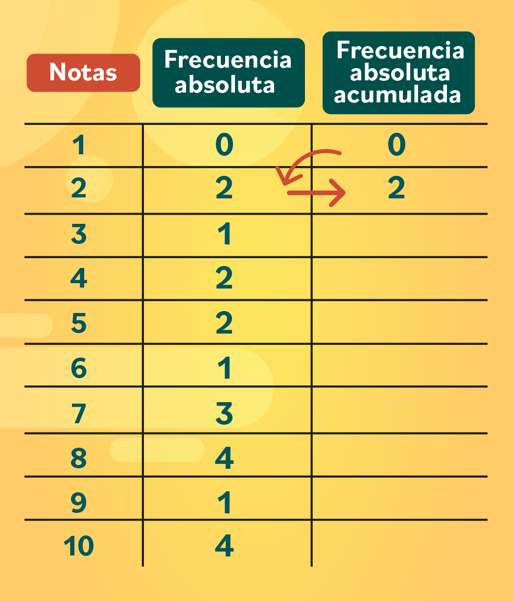
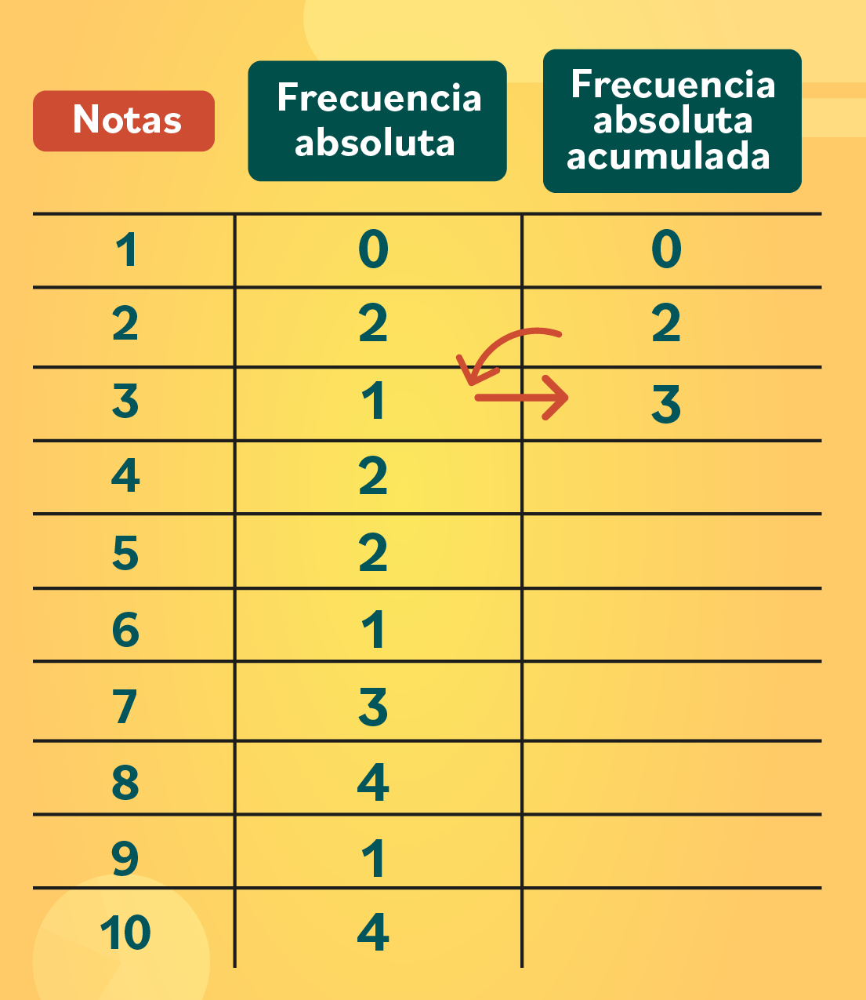
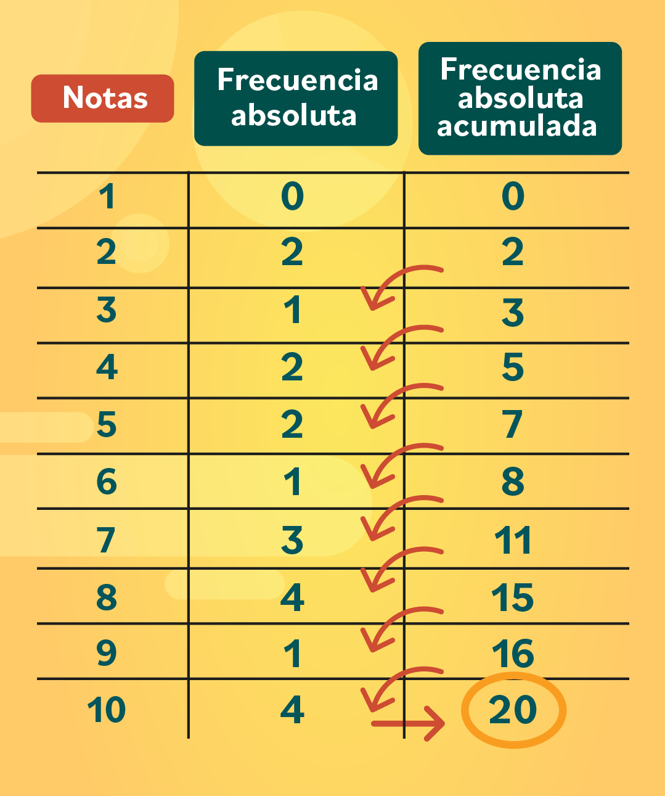
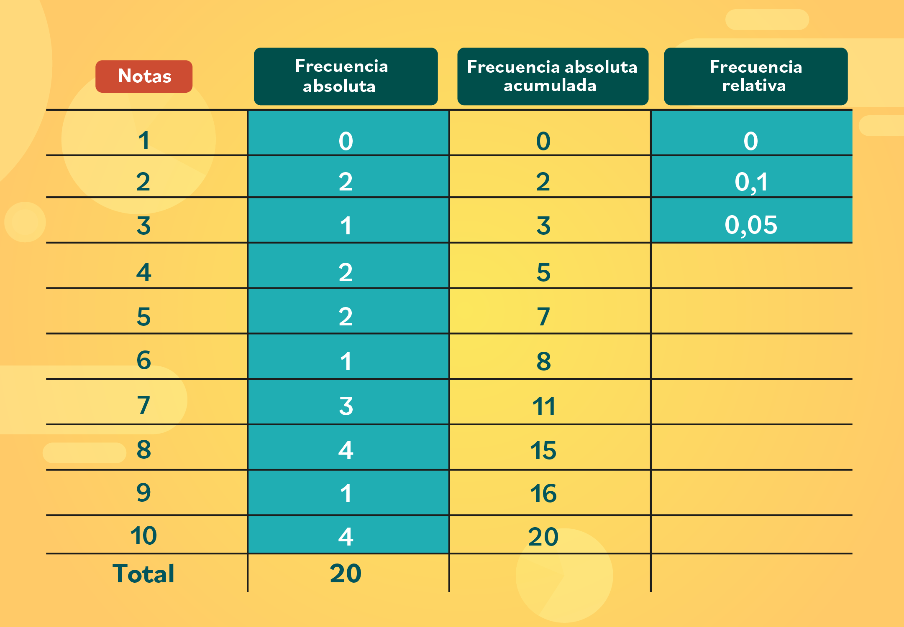
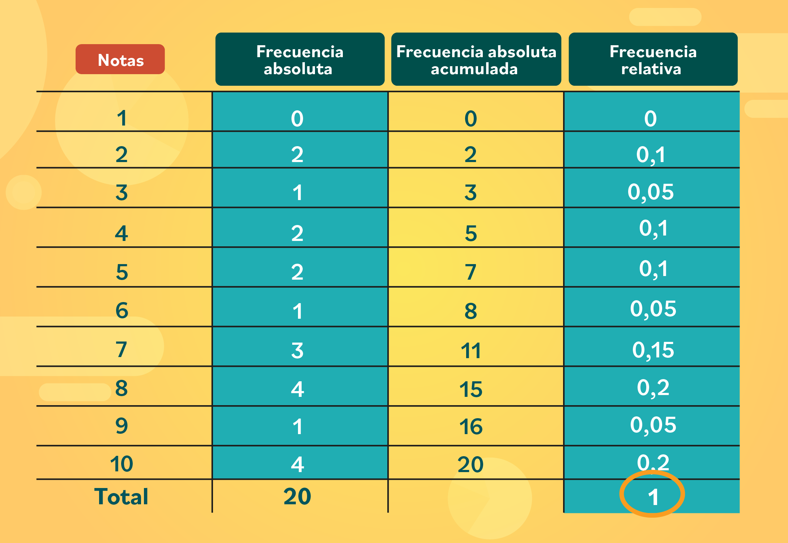
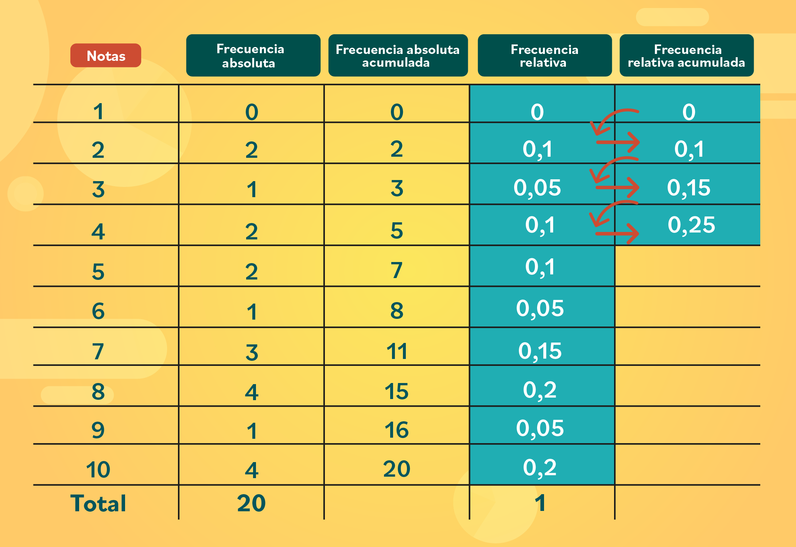
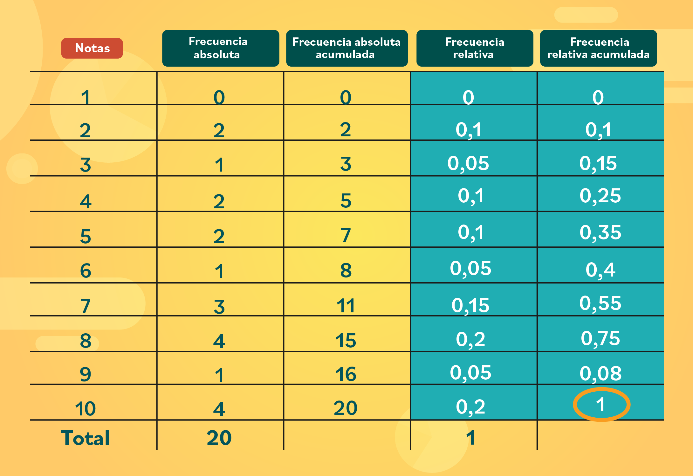
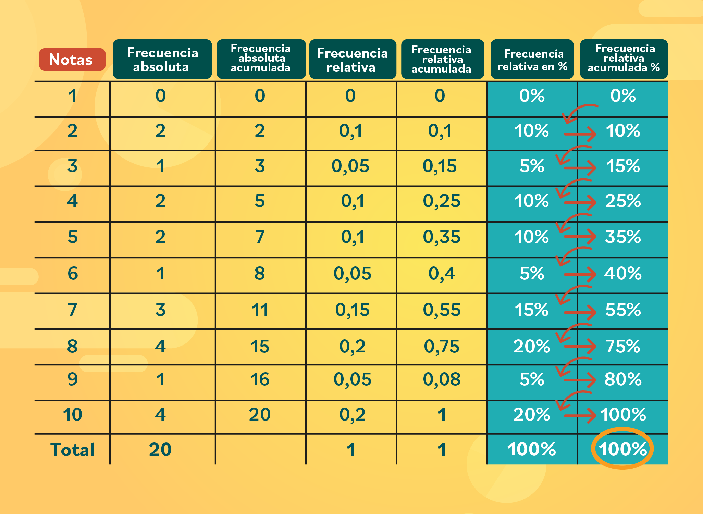

# Distribución de frecuencias

## Contenido

- [Distribución de frecuencias](#distribución-de-frecuencias)
  - [Contenido](#contenido)
  - [¿Qué es una tabla de frecuencias?](#qué-es-una-tabla-de-frecuencias)
    - [Tipos de frecuencias](#tipos-de-frecuencias)
    - [¿Cómo construir una tabla de frecuencias?](#cómo-construir-una-tabla-de-frecuencias)
    - [Frecuencia relativa y la frecuencia relativa absoluta](#frecuencia-relativa-y-la-frecuencia-relativa-absoluta)
  - [Tarea](#tarea)

## ¿Qué es una tabla de frecuencias?

Una tabla de frecuencias muestra de forma ordenada un conjunto de datos estadísticos y a cada uno de ellos le asigna una frecuencia que, en pocas palabras, son las veces que se repite un número o dato.

> :bulb:Puedes usar las tablas de frecuencias para ordenar variables **cuantitativas** o **cualitativas**.

### Tipos de frecuencias

- **Frecuencias absolutas**: son el número de veces que se repite un número en un conjunto de datos.
- **Frecuencias absolutas acumuladas**: es la suma de las frecuencias absolutas.
- **Frecuencia relativa**: corresponde a las veces que se repite un número en un conjunto de datos respecto al total, pero se expresa en porcentajes ($\%$).
- **Frecuencia relativa acumulada**: es la suma de las frecuencias relativas.

### ¿Cómo construir una tabla de frecuencias?

Vamos a tomar como ejemplo un salón de clases. Imagina que eres profesor o profesora de biología de $20$ estudiantes y tienes las notas finales del cuatrimestre.

Sigue estos pasos para construir tu tabla de frecuencias:

- Paso 1:

    Reúne los datos.

    
- Paso 2:

    Crea una nueva tabla. En la primera columna, ubica las notas de 1 a 10, de menor a mayor. En la segunda columna, escribe la cantidad de veces que se repite cada nota y llama a estos datos frecuencia absoluta.

    
- Paso 3:

    Hasta aquí tienes una **tabla de frecuencias** sencilla, pero también puedes agregarle una columna más para calcular la **frecuencia absoluta acumulada**. Sus valores se obtienen sumando los datos en diagonal.

    >Por ejemplo: el primer número siempre va a  ser igual al primer dato de la **frecuencia absoluta**, en este caso es **cero**. Luego, para obtener el segundo dato, necesitas sumar el **cero** con el **dos**, que es el segundo número de la frecuencia absoluta y justamente, el que está ubicado de forma diagonal. Entonces: $0 + 2 = 2$.

    

- Paso 4:

    Sigue sumando los números en diagonal. Ahora es el turno de $2 + 1 = 3$. Continua hasta llenar toda la columna.

    
- Paso 5:
    Una forma de verificar que la suma es correcta, es obteniendo como número final la cantidad de datos que tienes. En este caso, sería igual a $20$, porque son las notas de $20$ estudiantes. ¡Y listo!

    

### Frecuencia relativa y la frecuencia relativa absoluta

Al inicio de este documento, te explicamos que la **frecuencia relativa** se expresa en **porcentajes**. Mira cómo puedes obtenerlos a partir de los datos que ya tienes.

- Paso 1:

    ¡Continuemos con la tabla de frecuencias del salón de clases! Añade una cuarta columna con el nombre **frecuencia relativa**. Toma cada dato de la **frecuencia absoluta** y divídelo entre $20$, que es la cantidad de datos totales que tienes. Así:

    $$ 0 ÷ 20 = 0$$
    $$2 ÷ 20 = 0,1$$
    $$1 ÷ 20 = 0,05$$

    
- Paso 2:

    Realiza las divisiones hasta obtener todos los datos. Al final, la suma de esos valores debe darte $1$.

    

    Si al sumar el resultado que obtienes es $0.98$ o un número similar, no te preocupes, **puedes aproximarlo a $1$**.

- Paso 3:

    Para la **frecuencia relativa acumulada** debes sumar los datos en diagonal, como lo hicimos para la **frecuencia absoluta acumulada**.

    Entonces, el primer número siempre va a  ser igual al primer dato de la frecuencia relativa, en este caso es **cero**. Luego, para obtener el segundo dato, necesitas sumar el **cero** con el $0.1$, que es el segundo número de la frecuencia relativa y justamente, el que está ubicado de forma diagonal. Así:

    $$0 + 0.1 = 0.1$$
    $$0.1 + 0.05 = 0.15$$
    $$0.15 +  0.1 = 0.25$$

    

- Paso 4:

    Suma todos los datos en diagonal hasta llenar toda la columna. El último número que obtengas debe ser $1$.

    

- Paso 5:

    ¡Ahora sí vamos a descubrir los porcentajes de la frecuencia relativa! Toma cada valor de la columna frecuencia relativa y multiplícalo por $100$. Por ejemplo:

    $$0 x 100 = 0$$
    $$0.1 x 100 = 10$$
    $$0.05 x 100 = 5$$

    Al final, la suma de esa columna debe dar **$100\%$**.

    

- Paso 6:

    Para terminar, calcula el porcentaje de la frecuencia relativa acumulada en porcentajes. Sus valores se obtienen sumando los datos en diagonal.

    > Por ejemplo: el primer número siempre va a  ser igual al primer dato de la frecuencia relativa en $\%$, es decir, a cero por ciento. Luego, para obtener el segundo dato, necesitas sumar el cero con el $10\%$, que es el segundo número de la frecuencia relativa  y  el que está ubicado de forma diagonal. Entonces: $0 + 10 = 10$.

    Continúa:

    $$10 + 5 = 15\%$$
    $$15 + 10 = 25\%$$
    $$25 +  10 = 35\%$$

    

    El último número que obtengas debe ser $100\%$.

Así puedes crear tu propia tabla de frecuencias. Solo recuerda:

- :pushpin: Reunir tus datos y organizarlos.
- :pushpin: Calcular la cantidad de veces que se repite un dato para obtener la frecuencia absoluta.
- :pushpin: Sumar los valores diagonalmente para obtener las frecuencias acumuladas.
- :pushpin: La frecuencia relativa se expresa en porcentajes.

## Tarea

1. Durante el mes de julio, en una ciudad se han registrado las siguientes temperaturas máximas:

    $$32, 31, 28, 29, 33, 32, 31, 30, $$
    $$31, 31, 27, 28, 29, 30, 32, 31, $$
    $$31, 30, 30, 29, 29, 30, 30, 31, $$
    $$30, 31, 34, 33, 33, 29, 29.$$

    Crea la tabla de frecuencias, esta debe tener cada dato, sus frecuencias absolutas, frecuencias acumuladas, frecuencias relativas, frecuencias relativas acumuladas y estas últimas representadas en porcentaje.
2. Los pesos de los $65$ empleados de una fábrica vienen dados por la siguiente tabla

    |Peso|$f_i$|
    |-|-|
    |$[50, 60)$|$8$|
    |$[60, 70)$|$10$|
    |$[70, 80)$|$16$|
    |$[80,90)$|$14$|
    |$[90, 100)$|$10$|
    |$[100, 110)$|$5$|
    |$[110, 120)$|$2$|

    crea su respectiva tabla de frecuencias.
