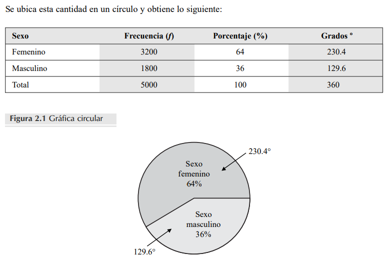
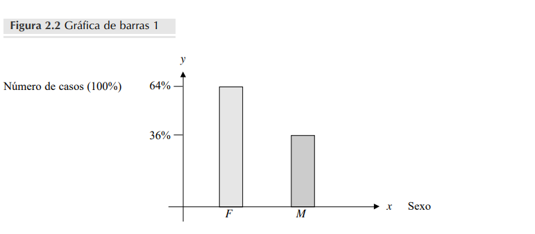
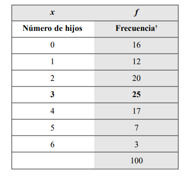
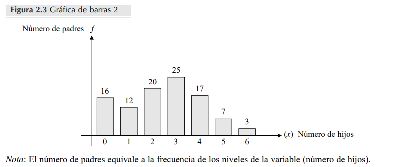
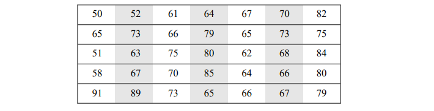
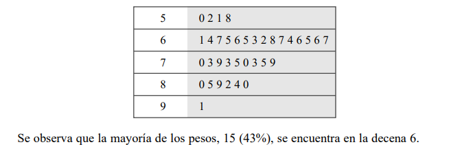
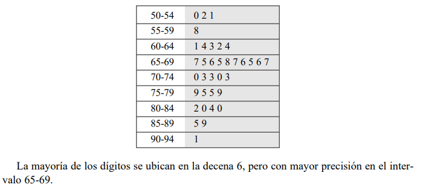
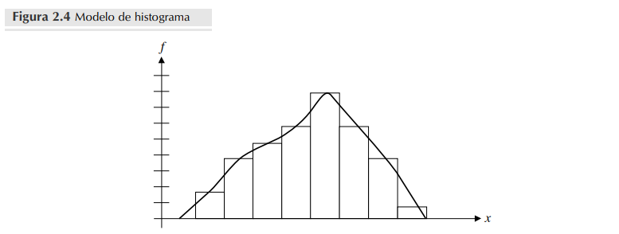
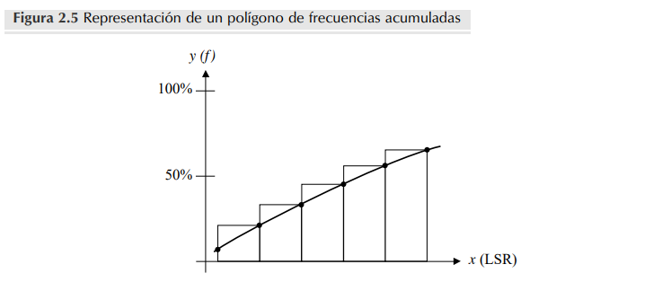

# Descripción de datos

## Introducción

La estadística se considera un método utilizado para recoger, organizar, concentrar, reducir, presentar,analizar, generalizar y contrastar los resultados numéricos (datos) de observaciones directas o indirectas de fenómenos reales, así como de la información obtenida a partir de la experimentación, para estaren condiciones de llevar a cabo tanto evaluaciones como conclusiones adecuadas, y tomar decisionesacertadas y confiables. En este capítulo se realiza un análisis estadístico que consistirá en organizar,concentrar, reducir y presentar en forma gráfica la información contenida en una muestra representativa de una población. Dicho análisis estadístico es de una sola variable, entendiendo por variable aquella característica susceptible de medirse, como la temperatura, el coeficiente de inteligencia, etcétera.

Una variable se clasifica como continua cuando la medición de una característica no presenta saltos ni rupturas, como la edad cronológica de una persona, la cual varía en años, meses, semanas, días, horas,minutos, segundos, décimas de segundo, etc. En cambio, en la variable discreta, aunque puede seguir unarazón de cambio, no hay continuidad, en otras palabras, existe una ruptura. Por ejemplo, el número dehijos que tienen las personas de un grupo, que puede ser cero hijos, uno, dos, etcétera.

## DATOS AGRUPADOS

### GRÁFICAS Y DISTRIBUCIONES DE FRECUENCIA

Para la mayoría de las personas cuando los datos se presentan en forma numérica, tienen poco significadoo carecen de él. En cambio, si se representan gráficamente, resultan muy eficaces para facilitar la comprensión y permiten extraer conclusiones acerca del comportamiento real de la variable. Pero es necesario queel impacto visual de la representación gráfica resuma la información, en forma clara, concisa y atractiva.

#### Gráfica circular (o de sectores)

Este método gráfico es uno de los más simples y usuales, y un instrumento auxiliar de análisis y presentación de la información, que resulta muy valioso para el investigador. Éste, como un diagrama enforma de círculo, es particularmente útil para visualizar las diferencias de frecuencia entre algunas categorías de nivel nominal.

- **Ejemplo 1**:

    En la figura 2.1 se representa una población (en determinado año) de 5000 estudiantes de la Facultad de Psicología de la Universidad Nacional Autónoma de México (UNAM), considerando únicamente la variable sexo.
    
    En esta gráfica se representa la correspondencia entre los $360$ grados de circunferencia, es decir, el círculo completo, con 100% de las observaciones, por tanto, para hacer esta gráfica es necesario tener los datos en porcentajes.
    
    En los $5000$ estudiantes, $64\%$ está constituido por mujeres y $36\%$ por hombres; para obtener la proporción de grados (el círculo tiene $360°$), aplique una regla de tres en la siguiente forma, tomando, en este caso, el dato del porcentaje de las mujeres 
    
    $$\frac{360°}{100\%}=\frac{x}{64\%}$$
    
    despejando $x$ la cantidad de grados correspondientes al $64\%$ es igual a $230.4°$

    

#### Gráfica de barras

Consiste en un conjunto de columnas separadas que representan la frecuencia o el porcentaje de cada uno de los valores o categorías de la variable de interés.

Según el caso anterior, donde $64\%$ son mujeres y $36\%$ hombres, la gráfica de barras sería la que se muestra en la figura 2.2, donde el eje horizontal ( $x$ ) representa la variable de interés (sexo) y el eje vertical ( $y$ ) representa la frecuencia (número de casos).

- Ejemplo 2
    En una empresa se entrevistó a todos los empleados que estaban por cumplir 20 años de servicio; entre las preguntas de dicha entrevista, considere únicamente la que hace referencia el número de hijos que tienen.
    
    A continuación, aparecen los datos obtenidos, organizados en una tabla de distribución de frecuencias. Una forma común de organizar un conjunto de datos, es agrupándolos en intervalos, categorías o clases, indicando la frecuencia o número de casos de cada uno de ellos.
    
    Con estos datos, se ha construido una gráfica de barras (figura 2.3)

    

Cuando la variable de interés es discreta, como en este ejemplo, una primera medida de tendencia central que puede analizarse es la moda, en otras palabras, el dato que tiene la mayor frecuencia de ocurrencia. En este caso, la frecuencia mayor es $25$ y la moda $3$, que representa $25\%$ de casos.

#### Diagrama de tallo y hojas

Los diagramas de tallo y hojas fueron desarrollados por primera vez en 1977. Representan una alternativa sencilla para el histograma, y son más útiles para resumir y describir datos cuando éstos no rebasan los cien. Sin embargo, a diferencia de lo que ocurre con un histograma, un diagrama de tallo y hojas no
pierde los datos originales.

Este tipo es una gráfica donde se presenta un conjunto de datos. Las decenas se consideran de diagrama el tallo y las unidades las hojas, las cuales deben siempre ubicarse a la derecha de éste. Así, el tallo se convierte en el eje principal y las hojas en los ejes secundarios. Una de las ventajas del diagrama
es que permite visualizar si los datos se distribuyen en forma simétrica.

- Ejemplo 3

    Al iniciar el torneo todos los miembros del equipo universitario de futbol, integrado por 35 jugadores, se pesan. Al terminar, se obtienen los siguientes valores en kilogramos:

    

    Para hacer un diagrama de tallo y hojas, deben seguirse los siguientes pasos:
    
    **Paso 1.** Para cada uno de los valores, el primer dígito se convierte en el tallo y el segundo
    en la hoja.
    
    **Paso 2.** Se ubican los tallos en orden ascendente a la izquierda de una línea vertical.
    
    **Paso 3.** Se coloca el segundo dígito a la derecha de dicha línea, enfrente de su dígito principal (tallo).
    
    **Paso 4.** En el ejemplo, para la construcción de la gráfica, el número más pequeño es 50.
    
    Entonces el tallo es 5 y la hoja 0.
    
    **Paso 5.** A continuación se localizan todas las decenas 5, el orden no importa.
    
    **Paso 6.** Los dígitos 2, 1 y 8, son las hojas y el diagrama queda en la siguiente forma:

    

Existe otra opción para integrar un diagrama de tallo y hojas. En lugar de distribuirlos en decenas, pueden hacerse intervalos de tamaño (dos, tres, ..., diez, etc.). Si se hace un diagrama con intervalos de tamaño cinco, se tiene:

#### Histograma

Este diagrama es útil cuando se trata de representar distribuciones de frecuencia cuya variable es continua, y viene dada en intervalos o clases; dicha gráfica se define y construye como la gráfica de barras, con la diferencia de que las columnas no están separadas, sino unidas, lo que le da continuidad.

#### Polígono de frecuencias

Es una gráfica lineal y se construye uniendo, por medio de segmentos, los puntos medios superiores (marcas de clase) de cada una de las columnas que forman el histograma. El polígono de frecuencias puede contener una amplia variedad de categorías o intervalos y tiende a destacar la continuidad a lo largo de una escala; por tanto, es útil para representar puntuaciones ordinales y de intervalos.

#### Polígono de frecuencias acumuladas u ojiva

La representación gráfica de frecuencias acumuladas (sumadas progresivamente) se denomina _polígono de frecuencias acumuladas_ y también recibe el nombre de _ojiva o diagrama de Galton_. Se obtiene uniendo, mediante una línea continua, los puntos cuyas ordenadas representan las frecuencias acumuladas de los intervalos y su abcisa, el límite superior real (LSR) de cada uno de ellos. La frecuencia acumulada de cada intervalo representa el número total de casos, dentro y debajo de un intervalo de clase en particular, como se muestra en la figura 2.5.

